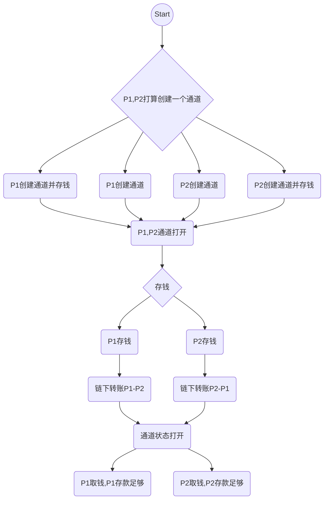
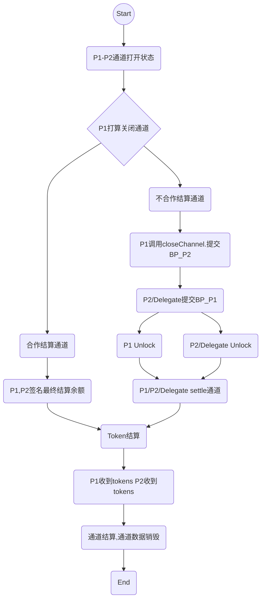
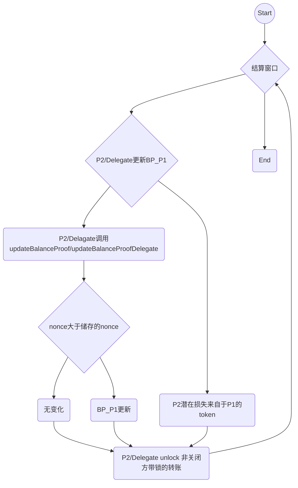

# 1.概述
这是smartraiden智能合约标准文档，用于构建smartraiden网络，包括与合约相关的总要求、数据结构、功能描述及相关语义等，不包括链下转账及相关查询功能描述。

# 2.要求
## 2.1 安全要求
- `双方不能共谋侵占 tokenNetwork 中的 token`


和smartraiden0.3版相比,这一版本合约设计时，从节约成本的角度考虑，没有采取一个通道建立一个合约的方式，即新建立的通道的 token 并没有抵押在一个单独的合约中, 而是特定token相关的所有通道会将所有的token都抵押在tokennetwork一个合约中。所以，可以认为tokennetwork存储着这个token所有通道的钱。因此，合约必须保证任意一个通道的双方不能通过合谋的方式花费超出他们共有存款总和的钱，因为超出的钱可能来自其他通道，对于安全方面要求必须满足此底线。

- `通道双方无论谁提供了错误的,虚假的数据不能给对方造成损害`

通道双方由于某种原因可能提供错误的、虚假的数据，合约必须保证无论双方任何一人提供了错误的数据，如结算时提供旧的或者修改的余额证明，有可能对另一方造成损害时，有认证和鉴别能力，不会导致对方利益受损。

- `通道双方无论谁提供了错误的,虚假的数据不能给自己带来不当收益`

通道双方由于某种原因可能提供错误的、虚假的数据，合约必须保证无论双方任何一人提供了错误的数据，如使用已声明放弃的锁的secret重新解锁，有可能让自己获得额外收益时，有实施惩罚的能力，不会让欺骗方受益。

- `通道双方无论谁都不能因为不配合,不作为而给对方造成损害`

通道生命周期中，有可能需要双方提交数据。如果通道一方自己错过提交数据时间或者故意不提交数据，如结算期的余额证明更新，合约必须保证主动提交方不受未提交方的限制，不会因此而受到损失。

- `通道双方无论谁提供了正确的数据,真实的数据,可以保证应得收入`

通道生命周期中，不同时期需要提交不同数据。如果通道一方在某个过程中提供了最新的，正确的数据，即使通道另一方没有提交数据或者提交了虚假的数据，作为诚实的一方，合约必须保证其可以拿到应得的收益。 


## 2.2 快捷

smartraiden提供快速转账，节点可以通过smartraiden在在token网络中进行快速链下支付，为避免余额不足造成中间节点中转转账周期过长，新版本采取了放弃余额不足中转交易重选路由的方式提升转账效率。

## 2.3 便宜
新版本在 Gas的优化上进行了设计，主要考虑普通用户参与创建通道,关闭通道,提交证明等方面的成本。与0.3版本一个通道一个合约相比，可以大幅降低gas花费。

## 2.4 其它要求

- 合约可以在多个流行的token标准下工作，目前支持ERC20和ERC223  
- 合约托管通道双方的存款，任一方可以在结算后取得他在通道里的存款  
- 不能让通道的一方有偷钱的机会，证实偷钱将受到惩罚  
- 合约支持第三方委托服务，在没有任何以太坊保证节点资金安全  

# 3.数据结构
## 3.1 余额证明
智能合约更新支付通道时要求的数据，参与者对余额证明进行签名。签名定义如下：


```solodity
ecdsa_recoverable(privkey, keccak256(channel_identifier||transferred_amount || locksroot || nonce || additional_hash || channel.open_block_number || token_network_address || chain_id)
```

字段：

字段名|字段类型|描述
--|--|--
channel_identifier|bytes32|通道的ID
transferred_amount|uint256|一方给另一方的所有转账
locksroot|bytes32|所有的等待锁的哈希值的默克树根
nonce|Uint64|单增的值用来排序转账，开始值为1
additional_hash|bytes32|应用层额外的哈希数据，如：支付元数据
channel.open_block_number|uint64|通道打开的区块数
token_network_address|address|TokenNetwork合约地址
chain_id|uint256|EIP155定义的Chain 标识
signature|bytes|对上述所有数据的签名

## 3.2 余额数据hash

`balance_hash = keccak256(transferred_amount || locksroot)`

字段名|字段类型|描述
--|--|--
transferred_amount|uint256|一个单增的值，通道参与者给另一方的转账
locksroot|bytes32|所有的等待锁的哈希值的默克树根

## 3.3 取钱证明

智能合约允许用户从一个通道中取钱不用关闭它。签名必须有效(以接收方为例)，定义如下：

```solodity
ecdsa_recoverable(privkey, sha3_keccak(participant1|| participant1_balance || participant1_withdraw || participant2|| participant2_balance || participant2_withdraw|| channel_identifier || channel.open_block_number || token_network_address || chain_id)
````

字段名|字段类型|描述
--|--|--
participant1|address|通道参与者一的地址
participant1_balance|uint256|通道参与者一提交的当前余额
participant1_withdraw|uint256|通道参与者一提交打算从通道内取钱的数量
participant2|address|通道另一个参与者的地址
Participant2_balance|uint256|通道参与者二提交的当前余额
Participant2_withdraw|uint256|通道参与者二提交打算从通道内取钱的数量
channel_identifier|bytes32|通道的ID
channel.open_block_number|uint64|通道打开的区块数
token_network_address|address|TokenNetwork合约地址
chain_id|uint256|EIP155定义的Chain 标识
signature|bytes|对上述所有数据的签名


## 3.4 合作结算证明

智能合约允许两个通道立即关闭和结算通道。签名定义如下：

```solodity
ecdsa_recoverable(privkey, sha3_keccak(participant1 || participant1_balance || participant2 || participant2_balance || channel_identifier || open_blocknumber|| token_network_address || chain_id)
```

字段名|字段类型|描述
--|--|--
participant1|address|通道参与者一的地址
participant1_balance|uint256|通道参与者一提交的余额数据，在结算后将收到的钱
participant2|address|另一个通道参与者
participant2_balance|uint256|通道参与者二提交的余额数据，在结算后将收到的钱
channel_identifier|bytes32|通道的ID
open_blocknumber|uint64|通道打开的区块数
token_network_address|address|TokenNetwork合约地址
chain_id|uint256|EIP155定义的Chain 标识
signature|bytes|对上述所有数据的签名

# 4.项目标准

## 4.1 新标准特殊功能

- `合作关闭通道`

在大部分的情况下，通道的双方是合作的。因此，单方关闭通道等待超时增加了复杂度和花费。为了提高效率，smartraiden增加了合作关闭设置，通道双方不用签名最近的余额证明，只需要签名表示同意最终状态。双方合作关闭通道,可以立即进行结算,顺利情况下可以在20秒内,将 token 返回到各自账户上。

- `不关闭通道取现`

通道参与双方通过协商一致,在不关闭通道的情况下,可以从通道中提取一部分资金到自己的账户。为了防止重放攻击，取钱后要重新设置通道打开的区块数，否则取钱后一方可以用旧的balanceproof关闭通道，获取额外利益。


- `更完善支持第三方服务`

第三方服务可以提供更多的服务, 通道参与双方可以在没有以太坊连接的情况下,参与进 smart raiden 网络,并且可以保证自己的资金安全。新合约目前支持的功能主要包括：支持委托 updateBalanceProof、支持委托 unlock、支持委托settle 通道、支持委托惩罚不诚实节点、支持委托合作关闭通道。根据上层业务需要，还可以扩展支持委托创建通道、委托存款、支持委托不关闭通道取现等。

- `引入惩罚机制`

在使用最短路径进行中转交易路由时，由于可用余额动态变化，经常出现路由节点余额不足不能转发转账的情况。0.3版本为了交易安全，采取了双方互锁的refundtransfer方式，但即使如此，依然存在节点在中转的两个通道的余额均不足的情况(无法互锁)，导致交易只有等待超时失败。为了提高路由效率及资金的利用率,设计了approvedisposed方式（声明放弃），中转节点声明放弃余额不足的转账，从通道双方的locksroot中移除这个转账，由前向节点重选路由转发。如果放弃锁的节点在结算前对已放弃的锁重新解锁，合约可以对不诚实的路由中间节点进行惩罚。

- `不会因为某个交易失败而导致关闭通道`

0.3版本是一个通道一个合约，为了保证节点交易的安全，如果存在交易风险（交易失败造成意外损失），会直接关闭通道保证节点资金的安全。与0.3版本相比，新版本判断过期时间通过链上注册时间，而不是由当前blocknumber决定，未完成的短期交易（锁超时）只要有secret注册即可认为安全。资金通道利用率更高,不会因为某个交易失败,而造成通道关闭。

- `支持 ERC223 token`

ERC223 token标准在现有的ERC20标准基础引入了一些新功能，防止意外转移的发生并提供部分新的token功能支持。目前已有部分token支持ERC223，为了使合约更具普遍应用价值，在新版本合约中我们也增加了对ERC223 token的支持。

- `支持 ERC20 扩展 ApproveAndCall`

为了优化合约token逻辑和业务逻辑，ERC20合约在使用中可以通过增加ApproveAndCall 接口对操作进行简化。目前已经有相当多的 token 支持这个功能，1.0版合约为适应更多token的调用需要，已增加ApproveAndCall扩展，支持多种模式的调用。


## 4.2 功能分解

新版本合约主要功能集中在TokenNetworkRegistry Contract、TokenNetwork Contract和SecretRegistry Contract三个合约中，我们分别对合约功能和应用场景进行描述。

### 4.2.1 `TokenNetworkRegistry Contract` 


TokenNetworkRegistry合约是构建TokenNetwork的前提。主要功能就是对某种token部署新TokenNetwork合约便于smartraiden进一步的调用。其主要属性包括：
- `address public secret_registry_address` 提供 `SecretRegistry` 合约地址给 `TokenNetwork` 构建使用   
- ` uint256 public chain_id`区块链ID用于防止重放攻击   

**注册一个token:**
部署一个新的TokenNetwork合约并对地址进行注册

`function createERC20TokenNetwork(address token_address) external
event TokenNetworkCreated(address indexed  token_address, address indexed token_network_address)`

1. `token_address`:  Token合约地址   
2. `token_network_address`: 新部署的TokenNetwork合约地址  

> 场景描述：假定一个用户拥有一些ERC20 token或ERC223token,但是该token没有被smartraiden注册。因此，在使用这个token进行链下支付之前需要对这个token进行注册建立一个TokenNetwork。smartraiden对每一个注册的token有一个相应的token network. 当该token network注册后，拥有token的用户就可以连接该网络并调用`TokenNetwork` 合约中的相关函数进行操作.

### 4.2.2  TokenNetwork Contract

TokenNetwork合约主要提供与支付通道交互的接口。通道只能对这个合约中通过 `token_address`定义的token进行转账。合约集中了通道生命周期中与合约交互的大部分函数，包括打开、资金/使用、关闭、结算等。除此之外，合约内还保存了通道函数所需的全局参数（属性），供函数调用时引用。其中，主要属性如下：

- `Token public token`  : 通道使用的token 实例   
- `SecretRegistry public secret_registry`:  secretregistry实例，中转转账中用于存储披露的secret   
- `Uint64 constant public punish_block_number=5`: 留给惩罚对手的时间,这个时间专门开辟出来,在settle timeout 之后,可以提交证据而不用担心对手是在临近 settle 之时提交 updatetransfer 和进行 unlock,从而导致自己没有机会提交惩罚证据   
- `uint256 public chain_idChainID` 被用于余额证明签名中以防止重放攻击  

新版本合约中，Channel Identifier 定义为bytes32, 是通道参与双方与tokenNetworkAddress的哈希值。我们当前限制两个参与者之间只能创建一条通道。因此，一对地址至多一个通道ID。合约提供了getChannelIdentifier函数、getChannelInfo 函数和getChannelParticipantInfo函数，用户可以调用他们查询当前通道信息和通道另一方的信息

```solidity
function getChannelIdentifier(address participant1, address participant2)
    view
   internal
    returns (bytes32 channel_identifier)
function getChannelInfo(
    address participant1,
    address participant2
)
    view
    external
    returns (bytes32 channel_identifier,  uint64 settle_block_number, uint64 open_block_number,uint8  state,  uint64  settle_timeout )

```
- `channel_identifier`: 当前合约计算的Channel identifier   
- `participant1`: 一个通道参与者的以太坊地址    
- `participant2`: 另一个通道参与者的以太坊地址    
- `state`:通道状态。可以是` NonExistent - 0`, `Opened - 1`, `Closed - 2,` `Settled – 0`    
- `settle_timeout`：通道结算等待时间     


```solidity
function getChannelParticipantInfo(
        address participant,
        address partner
)
    view
    external
    returns (
        uint256 deposit,
        bytes24  balance_hash,
        uint64  nonce
    )

```
- `participant`: 一个通道参与者的以太坊地址   
- `partner`: 另一个通道参与者的以太坊地址   
- `deposit`:通道打开后可能>=0   
- `balance_hash`: 对方locksroot和transferred_amount的哈希  
- `nonce`:对方最新交易的序号  


> 场景描述： 假定一个用户想使用smartraiden进行链下转账，以Alice发给Bob为例：Alice打算转账30个token给Bob。为了能够安全的完成转账，Alice需要知道她和Bob之前有没有通道（调用getChannelIdentifier函数）；如果有通道，当前通道是处于什么状态（调用getChannelInfo函数）；如果通道可以使用，那么通道对方的信息与Alice本地保存的数据是否一致（数据一致才能进行安全转账，调用getChannelParticipantInfo函数）

#### 4.2.2.1打开一个通道

功能：创建通道，是交易的前提。在participant1 和participant2 之间打开一个通道，设置通道的挑战期。

```solidity
function openChannel(address participant1, address participant2, uint64 settle_timeout)
 settleTimeoutValid(settle_timeout)
event ChannelOpened(
    byte32 indexed channel_identifier,
    address  participant1,
    address participant2,
    uint64 settle_timeout
);

```
- `channel_identifier`: 当前合约计算的Channel identifier   
- `participant1`: 一个通道参与者的以太坊地址   
- `participant2`: 另一个通道参与者的以太坊地址   
- `settle_timeout`:在调用`closeChannel` 和`settleChannel`之间需要挖矿的区块数   

`participant1`:和`participant2`都必须是有效地址，且不能相同，打开通道允许任何人调用，且可以调用多次，允许任意两个不同有效地址之间创建唯一的通道。通道创建后记录通道打开事件后方可进行转账交易。

>场景描述： 假定一个用户想使用smartraiden进行链下转账，以Alice发给Bob为例：Alice打算转账30个token给Bob。如果Alice和Bob是第一次使用smartraiden进行转账交易，他们之前没有直接通道相连。那么对于交易发起者Alice来说，她需要先调用合约的openChannel函数，将自己和Bob的地址代入函数，在两者之间建立唯一的一条通道。此时，双方建立的通道内没有token，Alice和Bob可以在通道建立后，单独进行存款操作。

#### 4.2.2.2 打开通道同时存款
主要功能：在participant1 和participant2 之间打开一个通道，打开通道方同时存一定数量的token, 这个函数为用户多提供一个选项,创建通道和存钱合在一起,可以更好的节省gas.

```solidity
function openChannelWithDeposit(address participant, address partner, uint64 settle_timeout,uint256 deposit)
event ChannelOpenedAndDeposit(
    byte32 indexed channel_identifier,
    address  participant1,
    address participant2,
uint64 settle_timeout，
uint256 participant1_deposit
); 
```
主要参数与打开通道相同，participant1:和participant2都必须是有效地址，且不能相同，participant1_deposit 表示打开同时需要存进通道内的token数量。openChannelWithDeposit允许任何人调用，其内部函数openChannelWithDepositInternal有三种调用方式：用户可以直接调用openChannelWithDeposit来间接调用；符合ERC223 token 也可以通过 tokenFallback 调用；ERC20token 提供了 ApproveAndCall, 用户可以通过receiveApproval调用.

>场景描述： 假定一个用户想使用smartraiden进行链下转账，以Alice发给Bob为例：Alice打算转账30个token给Bob。如果Alice和Bob是第一次使用smartraiden进行转账交易，他们之前没有直接通道相连。那么对于交易发起者Alice来说，她需要先建立通道，在通道内存了一定数量的token以后才能进行转账交易。Alice可以调用合约的openChannelWithDeposit函数，在建立通道的同时，存一部分token进通道内。完成了打开通道并存款的操作后，就可以使用这条通道进行转账。

#### 4.2.2.3存钱进通道

主要功能：在通道打开状态下进行存款。将token存进一个通道，增加通道其中一方在通道内的存款金额。允许被调用多次，允许被任何人调用。

```solidity
function deposit (
     address participant,
     address partner,
    uint256 amount
  )
  external
event ChannelNewDeposit(
   bytes32 indexed channel_identifier,
    address participant,
    uint256 total_deposit
);
```
- `participant`: 存款将增加的参与者地址   
- `total_deposit`:  `participant` 向通道存款的token数量   
- `partner`: 另一个通道参与者地址，用于计算channel_identifier  
- `channel_identifier`: 当前合约计算的Channel identifier  
- `deposit`: 参与者当前向通道存款的token数量  

>场景描述：以Alice向Bob转账为例。如果Alice在通道创建时没有进行存款，为了能够给Bob进行转账，则Alice需要调用deposit函数进行存款。deposit可以重复调用多次, Alice和Bob都可以调用。假定现在Alice存了100 token进通道，则目前通道总容量为100 token，其中Alice为100 token，Bob为0 token。

#### 4.2.2.4从通道取钱

主要功能:在不关闭通道的情况下提现,任何人都可以调用。允许一个通道参与者不用关闭通道从一个通道取钱。可以被任何人调用，每个签名的报文只能调用一次。一旦一方提出 withdraw, 实际上和提出合作结算效果是一样的,不能再进行任何交易，.必须等待 withdraw 完成才能重置交易数据,重新开始交易.

```solidity
function withDraw (
   address participant1，
   uint256 participant1_balance,
   uint256 participant1_withdraw,
   address participant2,
uint256 participant2_balance,
   uint256  participant2_withdraw,
    bytes participant1_signature,
    bytes participant2_signature
)
    public
event ChannelWithdraw(
    bytes32 indexed channel_identifier,
    address participant1,
uint256 participant1_balance
address  participant2,
uint256 participant2_balance
);

```
- `channel_identifier`: 当前合约计算的Channel identifier  
- `participant1`:通道参与者之一的地址  
- `participant1_balance`:参与者一提交的当前余额证明  
- `participant1_withdraw`: 参与者一提交的取钱金额  
- `Participant2`: 参与者二地址  
- `Participant2_balance`:参与者二提交的当前余额证明  
- `Participant2_withdraw`: 参与者二提交的取钱金额  
- `Participant1_signature`:  参与者一的对提交数据的签名  
- `Participant2_signature`: 参与者二的对提交数据的签名   

参与者通过协商的方式签名交换当前自己的余额证明以及打算取钱的金额，这个过程相当于通道结算后又重开，出于双方资金安全以及取现成功考虑，要求双方不持有任何锁（只要双方没有争议，就会在一定时间内清空持有的任何锁）
> 场景描述：Alice给Bob发送MediatedTransfer 进行转账（30token）。转账完成后，Alice的存款为70token,Bob的存款为30token，此时，因为交易成功发送，没有锁定token。Alice和Bob现在通道里都有了token，如果此时，双方想把一部分钱取出来该如何操作呢？假定Alice想取20token, Bob想取10token,因为此时双方都没有锁定token，则Alice可以调用合约中的withdraw函数，通过协商，将自己目前通道内存款(70token)、自己想取的钱(20token)、Bob通道内存款(30token)、Bob想取的钱(10token)与Bob达成一致后进行取钱操作。取钱操作完成后，双方的存款变为Alice 50token, Bob 20token，随后可以继续进行转账交易。

#### 4.2.2.5关闭通道

主要功能：参与者一方不想继续使用该通道，单方关闭通道，更新对方的余额证明。在挑战期没有结束前，通道不能结算。

```solidity
function closeChannel(
address partner,
uint256 transferred_amount,
    bytes32 locksroot,
    uint256 nonce,
    bytes32 additional_hash,
    bytes signature
)
    public
event ChannelClosed(uint256 indexed channel_identifier, address closing_participant,bytes32 locksroot,uint256 transferred_amount);
```
- `channel_identifier`: 当前合约计算的Channel identifier  
- `partner`: 通道非关闭方  
- `transferred_amount`:单增的值表示通道非关闭方转账给关闭方的总金额  
- `locksroot`: 通道非关闭方所有的等待锁的哈希值的默克树根  
- `nonce`:用于排序转账的单增的值  
- `additional_hash`:从报文中计算所得，用于报文认证  
- `signature`: 通道非关闭方提交的余额证明的签名  
- `closing_participant`: 调用函数的参与者地址，即通道关闭方  

closeChannel函数只能是通道参与方调用,只能调用一次,必须是在通道打开状态调用

>场景描述：Alice在与Bob进行一段时间交易后，不想再继续使用她们之间的这条通道。因此，Alice决定单方面调用closeChannel函数来关闭这条通道。Alice为了不损失钱，需要提交最新的余额证明（BOb给自己的钱），在合约里进行更新和记录。

#### 4.2.2.6更新非关闭方的余额证明

主要功能：更新非关闭方的余额证明，在通道关闭后调用。只能通道参与方调用,不限制是关闭方还是非关闭方,可以调用多次,只要在有效期内. 包括关闭方和非关闭方都可以反复调用,只要能够提供更新的 nonce 即可。目的是更新通道非关闭方的balance proof,不经过第三方委托。

```solidity
function updateBalanceProof (
    address partner,
    uint256 transferred_amount,
    bytes32 locksroot,
    uint64  nonce,
    bytes32 additional_hash,
    bytes partner_signature,
   )
    public
event BalanceProofUpdated (
    bytes32  indexed channel_identifier,
address  participant,
bytes32  locksroot,
uint256 transferred_amount 
  );

```
- `channel_identifier`: 当前合约计算的Channel identifier  
- `partner`: 通道非关闭方地址  
- `locksroot`: 通道关闭方所有的等待锁的哈希值的默克树根  
- `nonce`:用于排序转账的单增的值  
- `additional_hash`: 从报文中计算所得，用于报文认证  
- `partner_signature`: partner 一方对于给出证据的签名  

>场景描述：Bob得知Alice打算关闭他们之间的通道，为了防止自己受损失，Bob也需要提交余额证明（Alice给自己的钱）,Bob调用updateBalanceProof函数自己提交证明，在合约里进行更新和记录。

#### 4.2.2.7代理更新非关闭方的余额证明

主要功能：更新非关闭方的余额证明（主要是第三方），在通道关闭后调用。任何人都可以调用,可以调用多次,只要在有效期内。包括 关闭方、非关闭方和第三方都可以反复调用,只要能够提供更新的 nonce 即可。目的是更新partner的 balance proof。

```solidity
function updateBalanceProofDelegate (
address partner,
address participant,
    uint256 transferred_amount,
    bytes32 locksroot,
    uint64  nonce,
    bytes32 additional_hash,
bytes partner_signature,
bytes participant_signature
   )
    public
event BalanceProofUpdated (
    bytes32  indexed channel_identifier,
address  participant,
bytes32  locksroot,
uint256 transferred_amount 
  );

```
- `channel_identifier`: 当前合约计算的Channel identifier  
- `partner`: 通道非关闭方地址  
- `participant`: 通道关闭方地址  
- `locksroot`: 通道关闭方所有的等待锁的哈希值的默克树根  
- `nonce`:用于排序转账的单增的值  
- `additional_hash`: 从报文中计算所得，用于报文认证  
- `partner_signature`: partner 一方对于给出证据的签名  
- `participant_signature`: 委托人对于委托的签名  

>场景描述： Alice打算关闭与Bob之间的通道，为了防止受损失，Bob也需要提交余额证明（Alice给自己的钱）.假设Bob在关闭通道之前委托第三方代理提交余额证明。如果Alice关闭通道后，Bob由于特殊原因没有在线，第三方服务调用updateBalanceProofDelegate函数帮助Bob提交余额证明，在合约里进行更新和记录。

#### 4.2.2.8解锁 lock

主要功能：通道关闭后对注册secret的锁进行解锁。解锁等待的转账，通过提供等待转账数据的merkle_proof。只允许通道参与方可以调用,要在有效期内调用.通道状态必须是关闭,并且必须在 settle 之前来调用.只能由通道参与方来调用.

```solidity
function unlock(
address partner,
uint256 transferred_amount,
uint256 expiration,
uint256 amount,
    bytes32  secret_hash,
    bytes merkle_proof
)
    public
event ChannelUnlocked(
    bytes32 indexed channel_identifier,
    address payer_participant,
    bytes32 lockhash,
    uint256 transferred_amount
  );

```
- `channel_identifier`: 当前合约计算的Channel identifier  
- `partner`: 通道参与一方,他发出的某个交易没有彻底完成  
- `transferred_amount`: partner 给出的直接转账金  
- `expiration,amount,secret_hash`: 交易中未彻底完成的锁  
- `merkle_proof`: 证明此锁包含在 locksroot 中  

>场景描述：在Alice和Bob进行转账的过程中，有可能有部分交易未完成，假定Alice和Bob的存款分别为50(10)token,20token,其中括号内10 token为锁定的，是Alice给Bob的。Alice关闭通道之后，如果此时这个锁的secret已经在链上注册了，那么Bob就可以调用unlock函数将这10个token加到Alice给Bob的钱总数上。如果此时Bob不诚实，又拿上次放弃的锁的信息（30token）去解锁，将这个30个token也加到Alice给Bob的钱总数上，那么他将受到惩罚。

#### 4.2.2.9代理解锁 lock

主要功能：通道关闭后对注册secret的锁进行解锁（主要给第三方调用）。解锁等待的转账，通过提供等待转账数据的merkle_proof。任何人都可以调用,可以反复调用多次。存在第三方和对手串谋 unlock （导致惩罚）的可能,导致委托人损失所有金额，所以必须有委托人签名。

```solidity
function unlockDelegate (
address partner,
address participant,
uint256 transferred_amount,
uint256 expiration,
uint256 amount,
    bytes32  secret_hash,
bytes merkle_proof,
bytes participant_signature
)
    public
event ChannelUnlocked(
    bytes32 indexed channel_identifier,
    address payer_participant,
    bytes32 lockhash,
    uint256 transferred_amount
  );

```
- `channel_identifier`: 当前合约计算的Channel identifier  
- `partner`: 通道参与一方,他发出的某个交易没有彻底完成  
- `participant`:通道参与另一方，委托人  
- `transferred_amount`: partner 给出的直接转账金  
- `expiration,amount,secret_hash`: 交易中未彻底完成的锁   
- `merkle_proof`: 证明此锁包含在 locksroot 中  
- `participant_signature`: 委托第三方的签名  

>场景描述：在Alice和Bob进行转账的过程中，有可能有部分交易未完成，假定Alice和Bob的存款分别为50(10)token,20token,其中括号内10 token为锁定的，是Alice给Bob的。假定Bob有事需要下线，在Bob下线前委托第三方代理解锁。在Alice关闭通道后，如果Bob不在线，第三方会查看这个锁的secret是否已经在链上注册，如果secret已注册,第三方调用unlockDelegate函数将这10个token加到Alice给Bob的钱总数上。


#### 4.2.2.10惩罚孤立锁

主要功能：惩罚中间节点不诚实解锁。对于交易过程中已经宣布放弃的锁，如果另一方使用secret重新解锁，要对其进行惩罚。结算通道之前，给 punish 一方留出了专门的 punishBlock 时间,punish 一方可以选择在那个时候提交证据,也可以在这之前。这个主要是用于转账过程中余额不足时，中转节点声明放弃该锁的转账后，如果中间节点将这个放弃的锁解锁获得额外利益，将受到惩罚。

```solidity
function  punishObsoleteUnlock (
address  beneficiary,
address cheater,
bytes32 lockhash,
bytes32  additional_hash,
bytes cheater_signature
)
    public
event ChannelPunished (
    bytes32 indexed channel_identifier,
    address beneficiary
  );

```
- `beneficiary`: 惩罚提出者,也是受益人  
- `cheater`: 不诚实的交易一方  
- `lockhash`: 欺骗的某个锁  
- `additional_hash`: 实现辅助信息  
- `cheater_signature`: 不诚实一方对于放弃此锁的签名  

>场景描述：Alice在结算窗口期后，为了防止Bob  unlock已放弃的锁，在惩罚窗口期内她要调用punishObsoleteUnlock函数检查这个放弃的锁有没有被unlock。（假设Alice和Bob的关闭通道前存款分别为50(10)token,20token。）Alice从存储中取出Bob已放弃的锁的信息与BOb链上解锁情况进行对比，证明Bob确实unlock了已放弃的锁，那么根据惩罚机制，Alice得到Bob所有的存款，即Alice 70token, Bob 0token。

#### 4.2.2.11结算通道

主要功能：单方结算通道，将在通道中的押金退回到双方账户中。任何人都可以调用,只能调用一次。

```solidity
function settleChannel(
    address participant1,
    uint256 participant1_transferred_amount,
    bytes32 participant1_locksroot,
    address participant2,
    uint256 participant2_transferred_amount,
    bytes32 participant2_locksroot
)
    public
event ChannelSettled(
    uint256 indexed channel_identifier,
    uint256 participant1_amount,
    uint256 participant2_amount
); 

```

- `channel_identifier`: 当前合约计算的Channel identifier  
- `participant1`:  一个通道参与者的以太坊地址  
- `participant1_transferred_amount`: participant1向participant2转账的token ，一个单增的值  
- `participant1_locksroot`:所有的等待锁的哈希值的默克树根( participant1 向 participant2发送的等待的转账)  
- `participant2`:另一个通道参与方的地址  
- `participant2_transferred_amount`:  participant2 向 participant1转账的token，一个单增的值  
- `participant2_locksroot`:所有的等待锁的哈希值的默克树根(participant2向 participant1发送的等待的转账)  

在通道结算窗口期以及惩罚窗口期之后可以被任何人调用。通道状态Settled 意味着通道被结算并且通道数据被移除。

>场景描述：假如在惩罚窗口期中Alice没有发现Bob  unlock放弃的锁，则Alice在结算窗口期和惩罚窗口期后，就可以调用settle函数，根据双方提交的参数，计算分别向通道双方转账的token数量并进行转账结算。如Alice 40token ,Bob 30token。结算完成后，Alice将这条通道销毁。

#### 4.2.2.12合作关闭与结算通道

主要功能：双方协商一致关闭通道,将通道中的金额直接退回到双方账户。允许参与者合作提供双方的余额证明和签名,将通道中的金额直接退回到双方账户。可以立即关闭和结算通道，不用触发挑战期。任何人都可以调用,只能调用一次。合作结算不包括锁，在通道打开的状态下，双方协商进行结算，直接将余额转给对方，之前不用关闭通道，更新余额及解锁。

```solidity
function cooperativeSettle(
    address participant1,
    uint256 participant1_balance,
    address participant2,
    uint256 participant2_balance,
    bytes participant1_signature,
    bytes participant2_signature
)
Public
event ChannelCooperativeSettled（
bytes32 indexed channel_identifier,
uint256 participant1_amount,
uint256 participant2_amount
）

```
- `channel_identifier`: 当前合约计算的Channel identifier  
- `participant1`: 一个通道参与者的以太坊地址  
- `participant1_balance`:  participant1的通道余额  
- `participant2_address`: 另一个通道参与者的以太坊地址  
- `participant2_balance`:  participant2的通道余额  
- `participant1_signature`: participant1 对提交的合作结算证明数据的签名  
- `participant2_signature`: participant2 对提交的合作结算证明数据的签名  


*只要通道双方提供他们的签名，这个函数也可以被第三方调用*

>场景描述：如果Alice和Bob在链下达成共识，比如Alice 35token, Bob 35token, Alice和Bob也可以在通道打开的状态下，调用coopertiveSettle函数来合作结算这条通道。根据双方协商的金额（Alice 35token, Bob 35token）向双方转账，然后将这条通道销毁。


### 4.2.3 SecretRegistry Contract

这个合约将存储中转转账中所披露secret时的区块高度。与第三方服务协作时，作为一个安全措施，它允许第三方在委托方离线时代理委托方提供secret解锁被锁定的token。

```solidity
function registerSecret(bytes32 secret) public returns (bool)
event SecretRevealed(bytes32 indexed secrethash, bytes32 secret);
function getSecretRevealBlockHeight(bytes32 secrethash) public view returns (uint256)

```
- `secret`:用于得到secrethash的原像  
- `secrethash`: keccak256(secret). Secret的哈希值，用于中转交易

>场景描述：在Alice和Bob进行转账的过程中，有可能有部分交易未完成，假定Alice和Bob的存款分别为50(10)token,20token,其中括号内10 token为锁定的，是Alice给Bob的。如果在secret快要过期之前，Bob拿到secret向Alice请求交换unlock报文，没有得到Alice响应，为了自身的资金安全，Bob可以选择到链上注册这个secret（调用registerSecret函数）,并得到注册时的区块数（调用getSecretRevealBlockHeight函数）。

# 5. 流程描述

## 5.1 打开通道流程图


## 5.2 通道结算流程图



## 5.3 通道结算窗口期内流程


## 5.4 解锁等待的转账流程


## 5.5 流程中一些值限制

**BalanceProof的一些限制（以通道参与方P1->P2转账为例：**
P1如果有两个连续的余额证明， BP1k和 BP1t， k < t, 则签名报文中需要进行下列限制：

- 直接转账或一个成功的中转转账（value 个token）完成 ,则Transferamount1t==Transferamount1k+value,并且Locked1t==Locked1k

- 带锁的中转转账（（value 个token）未完成时，则
Transferamount1t==Transferamount1k,并且Locked1t==Locked1k+value

- 解锁前一个锁（ value 个token）完成时，则
Transferamount1t==Transferamount1k+value,，并且Locked1t==Locked1k-value

- 前一个锁（ value 个token）的转账过期，则
Transferamount1t==Transferamount1k，并且Locked1t==Locked1k-value

结算值限制：

p1_amount=p1_deposit + p2_transferamount- p1_transferamount 
如果p1_deposit + p2_transferamount< p1_transferamount,则p1_amount限制为0。
否则，p1_amount为p1_amount和p1_deposit二者之间较小者。
p2_amount = total_deposit - p1_amount。

# 6 项目成本优化
此次合约设计中，在创建通道、存钱、取现、关闭通道、更新余额、结算通道等各个函数细节方面进行了优化，主要表现在以下几下方面：

- 能不用全局变量的尽量避免使用，多用参数传递和计算获得  
- 没有安全风险的尽量不使用require限制  
- 通道数据不使用的尽量销毁收回合约存储空间  
- 尽量减少函数的复杂度，避免代码漏洞造成的补丁占用存储   
- 可以组合使用的函数提供批处理接口  

**以下为经过统计得出的gas成本:**

## 6.1创建通道
最理想情况下,创建通道成本几乎可以降低到原来的1/10. 在0.3版本下,通道双方创建通道,并互相抵押保证金,大概花费120万 gas. 在1.0版本下,通道双方创建通道,并互相抵押保证金,最低可以到14万 gas。下面列出了各种创建通道函数的gas花费（含创建通道同时存款）：

- Approve 30418  
- OpenChannel 48913  
- OpenChannelAndDeposit 91618  
- OpenChannelAndDeposit   
- tokenFallback 88910  
- OpenChannelAndDeposit ApproveAndCall 104098  


## 6.2存钱进通道

合约存钱调用提供了三种方式，以下为三种方式的gas花费：

- Deposit 69956  
- Deposit tokenFallback 52572    
- Deposit ApproveAndCall 67702,83097  

## 6.3不关闭通道提现成本

不关闭通道取钱是1.0版本的新功能，gas花费如下：

- withdraw:114905  

## 6.4关闭通道成本

关闭通道根据关闭方是否提交余额证明，分为两种gas 花费：

- CloseChannel （无证据）:32891
- CloseChannel（ 有证据）:66694

## 6.5更新通道余额成本

更新通道包括代理更新及通道参与方更新两种，两种gas花费如下：
- UpdateBalanceProofDelegate:75791  
- updateBalanceProof 62046  

## 6.6 unlock成本（单个锁）
解锁单个锁也分为代理解锁和通道参与方解锁两种，每次解一个锁的成本相同，gas花费如下：

- unlockDelegate/unlock:67664 

## 6.7惩罚交易成本

结算通道之前，需要调用punish函数判断是否有不当得利，惩罚独立锁gas花费：

- punish: 39064,69064  

## 6.8结算通道成本

结算通道分为单方结算和合作结算，以下为两种情况下结算通道gas花费:

- settle channel:51674(实际),103347(估计)
  
- CooperativeSettle: 77570,122570


