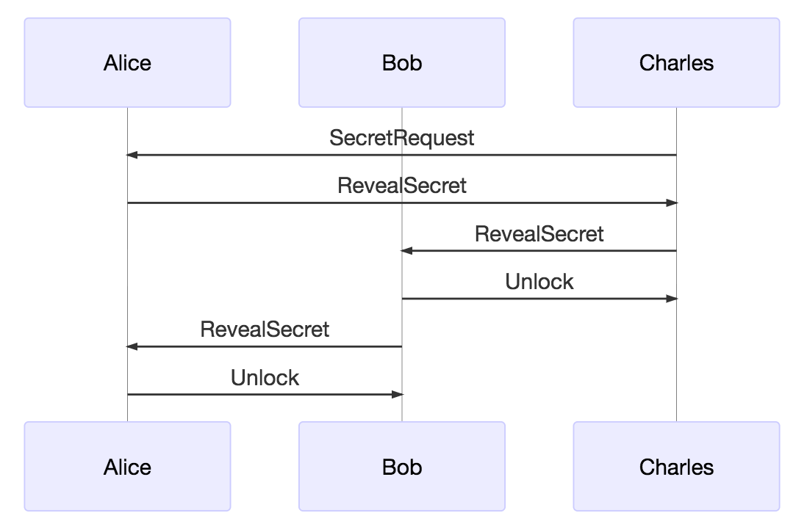

## Overview
This page primarily introduces Photon Messages, which is a bunch of data structures used in communication among our off-chain payment channels. Users or Clients can send and receive these messages to claim what they plan to do and present their intention to their transaction partners.

## Data Structure

### BalanceProof
BalanceProof is a basic data structure contained in most of messages below that sent or received by a channel participant. Our design principle is once BalanceProof in a message has changed, nonce in that BalanceProof should increase by 1.  

**Data Field** : 

 Names|Types|Description
 --|--|--
 Nonce|uint64|a serial number to record transfer
 ChannelIdentifer|Hash|a 32-byte hash denoting channel id
 OpenBlockNumber|int64|the block height at which a channel open
 TransferAmount|BigInt|the amount of tokens transferred to the counterpart
 Locksroot|Hash|root of a merkle tree,which contains all transfer locks of message sender 

 ### SignedMessage
 SignedMessage is an underlying data structure almost contained in every message that sent or received by a channel participant. In this structure, we mainly put address of message sender and the signature of sender.

Names|Types|Description
--|--|--
CmdStruct|compound type|structure for local storage 
Sender|Address|address of this message sender
Signature|[]byte|signature of this message sender

### EnvelopMessage
EnvelopMessage is an underlying data structure that contained in almost every message clients sent or received in a payment channel. In EnvelopMessage, there are a SignedMessage and a BalanceProof.

Names|Types|Description
--|--|--
SignedMessage|compound type| data structure for sender's information
BalanceProof|compound type|data structure for a transfer

## Messages

### ACK 
ACK is a data structure that our photon messages uses to confirm certain message has been received. It just echoes hash value of that received message.

**Data Field**:

Names|Types|Description
--|--|--
Sender|address|address of sender of that received message
Echo|Hash|a 32-byte hash value of that received message

### Ping
Ping is a message used to test the reachablity of a channel. In which, we just contain a nonce.

**Data Field**: 

Names|Types|Description
--|--|--
Nonce|int64|serial number for this message 

### SecretRequest
SecretRequest is a message primarily used when a transfer recipient in a payment channel want to get the secret of a transfer. In this case, he should send a SecretRequest to the initiator of this transfer and make transfer initiator understand that he wishes to get the secret.

**Data Field** :

Names|Types|Description
--|--|--
LockSecretHash|Hash|a 32-byte hash value of that secret
PaymentAmount|BigInt|the amount of tokens that this transfer locked

### RevealSecret
RevealSecret is a message used at the situation that transfer initiator in a payment channel, once he has received SecretRequest from that participant who needs the secret, reveals the secret of that participant.

**Data Field**:

Names|Types|Description
--|--|--
LockSecret|Hash|a 32-byte value denoting the secret og lock
LockSecretHash|Hash|a 32-byte value denoting the hash of secret of this transfer

### Unlock
Unlock is a message we adopt to deal with situations that a participant of a transfer plans to unlock the hash lock of this transfer.

- Unlock in MediatedTransfer

As we can view in this MediatedTransfer. We have three participants in this channel, Alice, Bob and Charles. The entire workflow is 

- After Charles has received the transfer from Alice, he wishes to get the secret via `SecretRequest` to Alice.
- Once Alice receives this `SecretRequest`, if there is no problem, then without doubt, Alice will feed this secret to Charles, via `RevealSecret`. 
- As to Charles, when he receives the secret from Alice, to get his deserved money, Charles prepares to reveal secret to his former hop node, Bob, via `RevealSecret`.
- When Bob has received this secret, and after he'd completed verification, he has two choices : 
    - First, If Bob can make sure that Alice is an honest actor and will unlock those money locked in her BalanceProof, Bob immediately send an `Unlock` to Charles to unlock money. But This is not our case.
    - Actually, Bob cannot rely on the virtue of integrity of Alice, so that he should make it certain that his money would not be stole by fraudulent actors. Our released version of Photon adds support that anyone who knows the secret can register this secret on the chain to claim their deserved fund. So Bob do not worry about his token, and he can directly unlock his transfer to Charles.

**Data Field** : 

Names|Types|Description
--|--|--
EnvelopMessage|compound type|a data structure containing a new BalanceProof and a signature of message sender
LockSecret|Hash|A 32-byte value denoting the secret of lock

### RemoveExpiredHashlockTransfer
RemoveExpiredHashlockTransfer is a kind of message and transfer participants primarily adopt it when ongoing transfers get expired for some reason, such as there are one or several mediated nodes disconnect from our token network, or some nodes intentionally stop furthering this transfer to next hop, and causes transfer expiration, etc. 

**Data Field** :

Names|Types|Description
--|--|--
EnvelopMessage|compound type|a data structure containing a new BalanceProof and a signature of this message sender
LockSecretHash|Hash|a 32-byte value denoting the hash of secret of this transfer

### DirectTransfer
DirectChannel is the message that mostly used in cases that a direct path exists to link two channel participants. Both just make their transfers sent to their channel counterparts via DirectTransfer. DirectTransfer can be sent by anyone in this direct payment channel in any times only if this direct channel is still open.

Because in this case we only have two participants : transfer initiator and transfer recipient, so there is no need to lock transfers.

**Data Field** :

Names|Types|Description
--|--|--
EnvelopMessage|compound type|a data structure containing a new BalanceProof and a signature of this message sender

### MediatedTransfer
MediatedTransfer is a message that is adopted mostly in cases that a participant has no direct route linking to his transfer recipient. By no means, this participant need resort to other indirect routes so that he can feed his transfer to specific recipient. Please NOTE, in direct payment channel, participants can also use MediatedTransfer.

**Data Field** :

Names|Types|Description
--|--|--
EnvelopMessage|compound type|a data structure containing a new BalanceProof 
Expiration|int64|block number at which this transfer expired
LockSecreHash|Hash|a 32-byte value denoting the hash of secret of this transfer
PaymountAmount|BigInt|the amount of kokens locked in this transfer
Target|Address|the final destination on this transfer
Initiator|Address|the initiator of this transfer
Fee|BigInt|transfer cost

### AnnounceDisposed
AnnounceDisposed is the message that we used in mediate transfer to notify that there are some issues which causes a mediated node has no way to further this transfer.  

**Data Field :**

Names|Types|Description
--|--|--
SignedMessage|compound type|a data structure containing a signature of message sender and an address of message sender
AnnounceDisposedProof|compound type|a data structure containing a lock to dispose and a channel id message

### AnnounceDisposedResponse
AnnounceDisposedResponse is the message we used when a participant replies to his partner after he/she has received AnnounceDisposedResponse.

**Data Field** :

Names|Types|Description
--|--|--
EnvelopMessage|compound type|a data structure containing a new BalanceProof and a signature of this message sender
LockSecreHash|Hash|a 32-byte value denoting the hash of secret of this transfer

### WithdrawRequest

WithdrawRequest is the message that mainly used in cases that a participant wishes to withdraw fund from his channel deposit. But first he needs to notify his partner about his intention and this intention needs to be confirmed by his partner.

**Data Field** :

Names|Types|Description
--|--|--
SignedMessage|compound type|a data structure containing a signature of message sender and an address of message sender
WithdrawRequesData|compound type|a data structure containing all required information of message sender 

### WithdrawResponse

WithdrawResponse is the message that recipient of WithdrawRequest has confirmed this message and he assigns his signature within and returns WithdrawResponse.

**Data Field** :

Names|Types|Description
--|--|--
SignedMessage|compound type|a data structure containing a signature of message sender and an address of message sender
WithdrawResponseData|compound type|a data structure containing a confirmation message with the signature of message recipient and the original WithdrawRequestData

### SettleRequest

SettleRequest is the message that channel participants adopt when they need CooperativeSettle that payment channel between them. Sender of this SettleRequest requests to cooperatively settle the channel.

**Data Field** :

Names|Types|Description
--|--|--
SignedMessage|compound type| a data structure containing a signature of message sender and an address of message sender
SettleRequesData|compound type| a data structure containing all information required by CooperativeSettle with the signature of sender of this SettleRequest

### SettleResponse

SettleResponse is the message that channel participants adopt when they just need to confirm the intention and agree with it. When recipient of SettleRequest wishes to present that he agrees to cooperatively settle this payment channel, then he just need to reply to his channel pal with this SettleResponse.

**Data Field** :

Names|Types|Description
--|--|--
SignedMessage|compound type| a data structure containing a signature of message sender and an address of message sender
SettleResponseData|compound type| a data structure containing all information required for CooperativeSettle with the signature of sender of this SetleResponse

