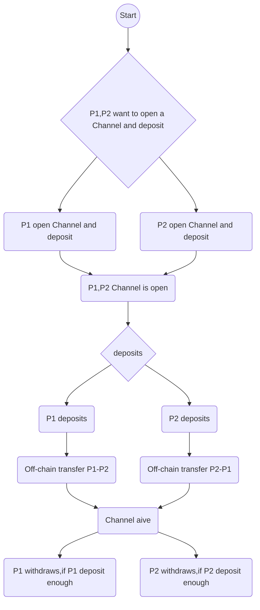

# Photon Contract Specification

## Overview 
### current Version 0.6
This is our contract specification for Photon Project, from which you can get information about Photon Network Construction, including  Requirement, Data Structure, Feature Description, etc, but in this spec there is no trace for off-chain transfer or any description about relevant check features.

## General Requirement
### Secure
#### Channel particpant cannot collude with his partner to steal tokens in TokensNetwork. 
Compared with photon 0.5,  we have adopted a new way that is to mortgage all tokens in one TokensNetwork contract for cost-saving, rather than to bond tokens of a specific type into a related contract. You can assume that in our TokensNetwork stores all types of tokens used in all payment channels.For such a reason, our contract must make sure that both participants of any channel cannot collude with each other to spend more than what they both deposit in the channel, because the excess tokens may come from other channels ,also the participants cannot withdraw money from other types of Token.This is our bottomline for security.  

#### No matter which in a channel provides faulty, fradulent proofs he cannot impair his channel partner's token.
Due to possibilities that channel participants are able to submit BalanceProofs with faulty, fradulent data, our contract ensures that if anyone in a channel does provide used/fradulent BalanceProofs up to mainchain, it can recognize and identify that proof and provide a remedy mechanism so that channel partner will not get impaired.  

#### No matter which in a channel provides faulty, fradulent proofs he cannot earn any profit from it. 
The newly-released smart contract ensures that no matter which in a channel provides faulty, fradulent BalanceProofs up to underlying  blockchain, such as using secret that is claimed abandoned to unlock the transfer in order to earn an invalid profit, the contract can make a punishment and slash all tokens of this fradulent node to his partner account. 

#### No matter which in a channel has no ability to impair his partner by ways of noncooperation, nonfeasance.
During the lifecyle of payment channels, it is necessary that both participants should submit their proofs. On the occasion that a channel participant misses the period to submit proofs or intentionally submits nothing, like not submit BalanceProof update at channel settle phase, our contract ensures that participant that has already submited proofs will not be affected by participant with no proof updated, and the former has zero possibility of being impaired. 

#### No matter which in a channel updates real, authentic proofs, he must get his deserved income. 
In the lifetime of payment channels, participants have to submit proofs in accord with the channel phases. As a honest actor, if he updates the most recently-generated, accurate proofs at a certain phase, our contrast validates that he can get his deserved benefit, even his partner does not update any proof or does with fradulent proof. 

### Instant
The newly-released contract provides instant transfer. Nodes (channel participants) can make an instant off-chain payment in our photon token network, so that there is less possibility for lengthy mediated transfers due to lack of channel balance. Our new version of contract has abandoned previous solution for channel lack of balance in mediated transfer, instead adopting a new method that is to re-route transfers in such cases. The efficiency for channel transfer has been improved. 

### Cost-Effective
The design for gas optimization has been adopted in our new version, which are mainly aimed at cost reduction in fields as user-involved channel creation, channel closing, and proof updates. Compared with previously-released contract, our new version can slash a huge amount of cost of gas. 

### Other Requirements  
- Contract is able to be compatible with multiple token standards, like ERC20 and ERC223.  
- Channel tokens are able to be entrusted to contract, any one of both participants has the ability to withdraw from contract after channels are settled.  
- Contract should support Photon Monitoring Service, to ensure assets safety when nodes offline.     

## Data Structure
###  Balance Proof

All the data requested by Photon contract when updating payment channels, channel participants should assign their signature to their Balance Proof. Signature defines as below :  
```soldity
ecdsa_recoverable(privkey, keccak256(channel_identifier || transferred_amount || locksroot || nonce || additional_hash || channel.open_block_number || chain_id)
```
#### Fields    
Field Names|Field Types   |Description
-----------|--------------|-----------
channel_identifier|bytes32|Channel identifier inside the TokensNetwork contract
transferred_amount|uint256|Monotonically increasing amount of tokens transferred by a channel participant
locksroot|bytes32 |Root of merkle tree of all pending lock lockhashes
nounce|uint64|a monotone-increasing serial number used to order transfers, The nonce starts at 1
additionl_hash|bytes32|Additional hash data, e.g.: payment metadata
channel.open_block_number|uint64|Block height at which a channel opens.
chain_id|uint256|EIP155 defined chain identifier
signature|bytes|Elliptic Curve 256k1 signature can be used to all above data

###  Balance Data Hash
```soldity
 Balance_hash = keccak256(transferred_amount || locksroot)
```

#### Fields

Field Names|Field Types|Description
-----------|-----------|--------
transferred_amount|uint256|Monotonically increasing amount of tokens transferred by a channel participant
locksroot|bytes32|Root of merkle tree of all pending lock lockhashes

###  Withdraw Proof
This newly-released contract allows for users to withdraw tokens from a channel without closing it  while channel is open and thesignature is  valid. Proof definition is as below (for example, the recipient):  
```soldity
 ecdsa_recoverable(privkey, keccak256(participant || participant_balance || participant_withdraw || channel_identifier || channel.open_block_number ||  chain_id)
```
#### Fields

Field Names|Field Types|Description
----------|--------------|----------
participant|address|One of the channel participant,who withdraws the tokens
participant_balance|uint256|Current channel balance of the participant
participant_withdraw|uint256|Token amount which the participant plans to withdraw from this channel
channel_identifier|bytes32|Channel identifier inside the TokensNetwork contract
channel.open_block_number|uint64|Block height at which channel opens
chain_id|uint256|Chain identifier as defined in EIP155
signature|bytes|Elliptic Curve 256k1 signature on the above data

### Cooperative Settle Proof
Our contract allows for both channel participants immediately to close and settle channel. Signature defined as below :    
```soldity
ecdsa_recoverable(privkey, keccak256(participant1 || participant1_balance || participant2 || participant2_balance || channel_identifier || open_block_number || chain_id)
```

#### Fields

Field Names|Field Types|Description
-----------|-----------|-----------
participant1|address|One of the channel participants
participant1_balance|uint256|Channel balance for participant1, which he can receive after channel settling
participant2|address|The other channel participant
participant2_balance|uint256|Channel balance for participant2, which he can receives after channel settling
channel_identifier|bytes32|Channel identifier inside the TokensNetwork contract
open_blocknumber|uint64|Block number at which channel opens.
chain_id|uint256|Chain identifier as defined in EIP155
signature|bytes|Elliptic Curve 256k1 signature on the above data

### Channel_identifier Calculation

```solidity
if (participant1 < participant2) {
    return keccak256(abi.encodePacked(participant1, participant2, token,TokensNetwork));
} else {
    return keccak256(abi.encodePacked(participant2, participant1, token,TokensNetwork));
}
```
In TokensNetwork contract, The channel is specified through the triple of <token, participant1, participant2>.

## Project Specification 

###  Feature Highlight

#### Cooperative Settling Channel

Under most circumstances, both channel participants are Cooperative. Hence, any channel participant attempting to unilaterally close the channel will boost the time consuming and cost. In order to minimize cost, photon adds up a feature to cooperative settling the channel in which both channel participants have no need to submit their most recent pre-signed balance proof on-chain, just to sign the signature to show the agreement to the final state. If approved, channel settle can be immediately processed, normally within 20 secs, tokens will be allocated accordingly to accounts of this channel participants.

####  Withdraw without closing the channel
 The participants of the channel can withdraw part of the funds from the channel to their accounts without closing the channel by consensus.  Due to the potential risk of replay attack, Field `open_block_number` has to be reset after withdraw, otherwise, channel participants have the chance to utilize used BalanceProofs to fraud and make an undeserved profit. 

#### More perfect support for third-party delegation
We add much more Third-party delegation serviecs in our new contract, so that channel participants can join our photon network and secure their assets on the condition of no internet connection. Major feature supported in our new contract includes

- Delegate `updateBalanceProof`  
- Delegate `unlock`  
- Delegate `channelSettle`  
- Delegate punishment to fraudulent nodes   
- Delegate `CooperateChannelClose`  

And we can also integrate supports like 

- Delegate `ChannelOpen`  
- Delegate `Deposit`  
- Delegate withdraw when channel is alive  

into our contract according to the demand of business.  

#### Introduce Punishment Mechanism
When using shortest-path algorithm to do a transfer routing, there are many cases that routers cannot further transfers due to lack of fund deposited in channel. In previous version 0.5, we adopt a method named `refundtransfer` in case that channel participants can interlock with each other to make transfer secure. However, even we use such a seemingly secure method, still we find that there are cases that channel participants cannot interlock with each other because of lack of balance in both mediated channels, which causes transfer to halt and wait for timeout. To maximize the routing efficiency and token usages, we design a new way `approveddisposed` to claim that mediated nodes give up those lack-of-fund transfers and channel participants remove locks of those transfers from their locksroot, and nodes ahead start to reroute and further those transfers again. If nodes that have already removed hashlocks in their locksroot try to re-unlock those removed locks, our new contract can punish these fradulent nodes. 

#### Failure Transfers Cause No Channel To Close
In previous contract version 0.3(not version 0.5), we adopt a mechanism that to create a contract for each channel. If any risk that may cause transfer failure or token loss occurs, in order for token security, payment channels will be closed. Compared with version 0.3, our new version confirms the expiration of a transfer according to the block number at which secret has been registered on-chain, instead to current block number. If a secret has been registered on-chain, even though there are unfinished transfers exists while transfers get expired, channel security can be assumed secure. Token utility rate of channels boost up so that our payment channels will not be closed due to transfer failure. 

#### Support ERC223 Token Standard
ERC223 token Standard has introduced several new features based on currently-used ERC20 standard, to prevent any occurance of accidental transfer, and it also adds support for new types of token. Right now, we have tokens supporting ERC223, and to empower our contract with more generally-applicable value, we also allow for ERC223 token standard in our new version of contract.  

#### Support ERC20 Extended ApproveAndCall
To optimize contract logic and business logic, we add support of ApproveAndCall interface to make our operation more concise. Currently there are many token providing support for this feature. Our version 0.5 contract also offers interface for this feature. 

###  Functional decomposition
Function are contained in contracts like TokensNetwork, and SecretRegistry. Next we are about to describe them in-depth. 
#### TokensNetwork contract
TokensNetwork is mainly a contract offering interfaces to interact with payment channels. Payment channels can only transfer tokens from `token_address` in this contract. TokenNetwork integrates most functions that payment channels interact with during their lifecycle, including ChannelOpen, Deposit/Withdraw, ChannelClose, ChannelSettle, etc. Apart from that, TokenNetwork contract maintains global variables for payment channels to use while certain functions are invoked. These variables includes 

- `Token public token` : Token instance used in TokensNetwork  
- `SecretRegistry public secret_registry` : Contract instance of SecretRegistry, used to register secret on chain   
- `uint64 constant public punish_block_number = 5` : Period for submitting fraud proof, in case that if fraudlent node submits `updatetransfer` or `unlock` at the time of settle, honest node has time to submit proofs to secure their fund.     
- `uint256 public chain_id` : Used in BalanceProof to prevent replay attack.     

In our new contract, `channel_identifier` is defined as `bytes32`, which is a hash value combined channel participants,tokenAddress and TokensNetworkAddress. We constrain that only one channel can be created within a pair of channel participants. Hence, an address pair can only hold one channel_id on the same token. Users can check channel information and channel partner via  `getChannelInfo`, and `getChannelParticipantInfo`.   

```solidity
function getChannelInfo(address token, address participant1, address participant2)
    view
    external
    returns (bytes32 channel_identifier,  uint64 settle_block_number, uint64 open_block_number,uint8  state,  uint64  settle_timeout )

```
- `token` :  The token type
- `channel_identifier` :Channel identifier calculated by the current contract.  
- `participant1` : Address for a channel participant
- `participant2` : Address for the other channel participant    
- `state` : Channel state, can be 0 ~ 2, which respectively means NonExistance/Settled, Opened, Closed.  
  
```soldity
function getChannelParticipantInfo(address token,address participant, address partner) view external returns(uint256 deposit, bytes24 balance_hash, uint64 nonce)
```
- `token` :  The token type
- `participant` : Address for a channel participant   
- `partner` : The counterpart of `participant` in that channel  
- `deposit` : Channel deposit of `participant` in that channel  
- `balance_hash` : Balance_hash in `participant`, which combines locksroot and transferred_amount of `participant`.   
- `nonce` : a most recent serial number of transfers for `participant`. 


**Scenario Description**  
>Assume that a user wishes to make a off-chain payment via photon, take Alice and Bob as example. Alice plans to transfer 30 tokens to Bob. In order to make a secure transfer, Alice  needs to know if she has created a payment channel with Bob and the channel state(assume existence) via `getChannelInfo`. If Alice is able to use that channel, then she has to check data consistency with Bob and hers stored in local storage via `getChannelParticipantInfo`. 

##### Open a channel with deposit 
**Function description：**
To create a channel within `participant` and `partner`, while depositing some amount of tokens inside the channel at the same time. Among the parameters, settle_timeout is the settlement window period from the channel closure to channel settlement. 

```soldity
function deposit(address token, address participant, address partner, uint256 amount, uint64 settle_timeout) external

event ChannelOpenedAndDeposit(
    address indexed token,
    address participant,
    address partner,
    uint64 settle_timeout,
    uint256 participant1_deposit
); 
event ChannelNewDeposit(
    bytes32 indexed channel_identifier,
    address participant,
    uint256 total_deposit
);
event TokenNetworkCreated(address indexed token_address);
```
The token must be a valid ERC20 address,the addresses for participant and partner must be valid, and have no resemblance.`amount` means the amount of tokens deposited into channel while open this channel. `Deposit` allows for anyone to invoke it, and `DepositInternal` has three ways to be invoked :

- Indirect call by call `Deposit`     
- Indirect call by call `tokenFallback` for those ERC223-compatible tokens   
- Indirect call by call `ApproveAndCall` for some ERC20-compatible tokens   

If such token did not exist in TokensNetwork before, the TokenNetworkCreated event will be triggered.

If the participant and the partner have no channel on such token before, ChannelOpenedAndDeposit event will be triggered.

If the participant and the partner already have channel on such token before,
ChannelNewDeposit event will be triggered 

**Scenario Decription**  
>Assume that a client has intention to use photon to make the payment off the chain. This time Alice and Bob as our example. Alice wants to send to Bob 30 tokens. If Alice and Bob has no direct payment channel between them, and Alice is required to create a new direct payment channel to Bob and deposit certain amount of tokens in it. Via `Deposit`, Alice can achieve that. Once `Deposit` has done invoking, users can start to make transfers.  

##### Deposit tokens in a channel
**Function description：** 
To deposit certain amount of tokens into a payment channel while that channel stay open. It will increase the amount of deposit in that channel. This function can be invoked multiple times by anyone in that channel.   
```soldity
function deposit(address token, address participant, address partner, uint256 amount, uint64 settle_timeout) external

event ChannelNewDeposit(
   bytes32 indexed channel_identifier,
    address participant,
    uint256 total_deposit
);
```
- `token` :The token type
- `participant` : Address of the participant who deposits tokens.  
- `total_deposit` : The amount of tokens that `participant` totally deposited into this channel.  
- `partner` :The address for which channel to specify.  
- `channel_identifier` : Channel identifier calculated by the current contract.  
- `amount` : The amount of tokens that current `participant` want to deposit
- `settle_timeout` :This parameter is ignored when the channel is created beforehand.    

**Scenario Description**  
>If Alice forgets to deposit her tokens while opening a payment channel, in order to do normal transfer, she needs to invoke `deposit` function to make certain amount of deposit. `deposit` can be invoked multiple times and both Alice and Bob can call it. Assume that Alice has made a deposit with 100 tokens, then currently there are 100 tokens in this channel(Alice does not deposit at the beginning), in which Alice accounts for 100 tokens of them, Bob, 0 token.  

##### Withdraw tokens from a channel
**Function description：** 
To withdraw tokens in this channel while channel is still open. Anyone of channel participants can invoke this function, and each signed message can only invoke it once. After a participant requests for withdraw, which has the same effect to `CooperativeSettle`, both participants cannot further any transfer till withdraw completes and transfer data has been reset, transferes between these two participants is able to resume.

```soldity
function withDraw (
        address token,
        address participant,
        address partner,
        uint256 participant_balance,
        uint256 participant_withdraw,
        bytes participant_signature,
        bytes partner_signature)
    public


event ChannelWithdraw(
    bytes32 indexed channel_identifier,
    address participant,
uint256 participant_balance
address  partner,
uint256 partner_balance 
);
```
- `token` :The token type
- `channel_identifier` : Channel identifier calculated by the current contract.  
- `participant` : Address of the participant who requests to withdraw tokens.  
- `participant_balance` : The amount of tokens currently available in `participant`'s BalanceProof.  
- `participant_withdraw` : The amount of tokens participant requests to withdraw.  
- `partner` : Address of the counterpart to `participant`.  
- `partner_balance` : The amount of tokens currently available in `partner`'s BalanceProof.  
- `participant_signature` : The signature of `participant`  
- `partner_signature` : The signature of `partner` 

These channel participants both sign their signatures and exchange their BalanceProof and withdraw amount in cooperative way, which is equivalent to cases that channel settle and reopen. In terms of assets security and successful rate, both channel participants are required to withold no locked transfer, which means as long as there is no dispute, every lock  in the locksroot will be removed within a specific period. 

**Scenario Description**  
>Alice plans to send Bob a transfer with 30 tokens. Once this transfer completes successfully, the amount of deposit of Alice is 70, and the amount of Bob is 30. At that time, there is no token has been locked in this channel. If now, one of them wants to withdraw part of their tokens deposited, how to do that? Assume that Alice wishes to withdraw 20 tokens from this channel, she can directly call `withdraw` due to the truth that there is currently no token has been locked. Via an interactive way, Alice makes an agreement with Bob about her current balance (70 tokens) and withdraw amount (20 tokens). After withdraw completes, channel balances of Alice and Bob turns to 50 tokens of Alice and 30 tokens of Bob. Then transfers can continue.

##### Close the payment channel 
**Function description：** 
If one of the channel participants would not want to continue using this channel, then he can ask for closing this channel and update BalanceProof of their participant. Before the challenge period timeout, this channel cannot be settled.

```soldity
function closeChannel(
    address token,
    address partner,
    uint256 transferred_amount,
    bytes32 locksroot,
    uint256 nonce,
    bytes32 additional_hash,
    bytes signature
)
    public

event ChannelClosed(uint256 indexed channel_identifier, address closing_participant,bytes32 locksroot,uint256 transferred_amount);
```
- `token` :The token type
- `channel_identifier` : Channel identifier calculated by the current contract.  
- `partner` : non-closing party of the channel  
- `transferred_amount` : The amount of tokens that `partner` has transferred to his counterpart.  
- `locksroot` : Root of the merkle tree of all pending lock lockhashes for the partner.  
- `nonce` : Strictly monotonic value used to order transfers   
- `additional_hash` : Computed from the message. Used for message authentication.  
- `signature` : Elliptic Curve 256k1 signature of the channel partner on the balance proof data.  
- `closing_participant` : Address of the channel participant who calls this function.  

`closeChannel` can only be invoked via channel participants, just once, and while this channel is open.

**Scenario Description**  
>After Alice and Bob have done quite a lot of transfers, Alice wishes to stop transfers and plans to close the channel. So, Alice determines to call `closeChannel` to this channel. In order to avoid losing tokens, Alice must update the newest BalanceProof from Bob upto the main chain to keep a record.  

#### Update non-closing participant balance proof
**Function description：**
To update BalanceProof from Non-Closing Participant, and this function can be called only after channel is closed. Only channel participants can invoke this function, and within settletimeout window it can be invoked multiple times. The aim is to update balance proof of non-closing  participant without Photon Monitoring Service.

```soldity
function updateBalanceProof (
    address token,
    address partner,
    uint256 transferred_amount,
    bytes32 locksroot,
    uint64  nonce,
    bytes32 additional_hash,
    bytes partner_signature,
   )
    public

event BalanceProofUpdated (
    bytes32  indexed channel_identifier,
address  participant,
bytes32  locksroot,
uint256 transferred_amount 
  );
```
- `token` :The token type
- `channel_identifier` : Channel identifier calculated by the current contract.  
- `partner` : The channel participant who is updating the balance proof data.  
- `locksroot` :Root of the merkle tree of all pending lock lockhashes for the partner.  
- `transferred_amount` : The amount of tokens that `closing_participant` has transferred to `partner`.  
- `nonce` : Strictly monotonic value used to order transfers  
- `additional_hash` : Computed from the message. Used for message authentication.  
- `partner_signature` :Elliptic Curve 256k1 signature of the `partner` on the balance proof data.  

**Scenario Description**   
>Bob receives messages that Alice plans to close payment channel between them, in order to avoid losing tokens, Bob also has to submit the most recent BalanceProof that Alice has sent. Then Bob is able to call `updateBalanceProof` to update that proof upto the main chain and keept a record.  

#### Delegate Update Balance Proof of Non-Closing Participant
**Function description：**
We provide some new function in our released version, which we call it Photon Monitoring Service. This function aims at situations when one of channel participants plans to delegate relevant services to a trustworthy third-party for some reasons. Only after channel is closed, this function can be invoked by anyone among both channel participants and the third-party, with multiple times. The purpose of this function is to update balance proof of `partner` via delegation.

```soldity
function updateBalanceProofDelegate (
    address token,
    address partner,
    address participant,
    uint256 transferred_amount,
    bytes32 locksroot,
    uint64  nonce,
    bytes32 additional_hash,
bytes partner_signature,
bytes participant_signature
   )
    public

event BalanceProofUpdated (
    bytes32  indexed channel_identifier,
address  participant,
bytes32  locksroot,
uint256 transferred_amount 
  );
```
- `token` :The token type
- `channel_identifier` : Channel identifier calculated by the current contract.  
- `partner` : Address of channel participant who does not ask for closing channel.  
- `participant` : Address of channel participant who requests for closing channel.  
- `locksroot` :Root of the merkle tree of all pending lock lockhashes for the partner.  
- `nonce` : Strictly monotonic value used to order transfers  
- `additional_hash` : Computed from the message. Used for message authentication.  
- `partner_signature` : Elliptic Curve 256k1 signature of the `partner` .  
- `participant_signature` : Elliptic Curve 256k1 signature of the `participant`(client).  

**Scenario Description**  
Alice prepares to close payment channel with Bob. In order to minimize the risk of losing tokens, Bob also has to update BalanceProof which he has got from Alice. Assume that Bob has delegated update BalanceProof of Alice before this channel closes. After Alice closes this channel, and Bob disconnects from this network, there is a third-party node facilitating Bob to call `updateBalanceProofDelegate` and update BalanceProof. 

#### Unlock
**Function description：**
This function we provide is to unlock transfers whose secrets have been registered. To unlock pending transfers, we need `merkel_proof` of those transfers. This feature can be applied only to channel participants within settletimeout period.It must be invoked before settlement,and the channel states has to be `closed`.

```soldity
function unlock(
    address token,
    address partner,
    uint256 transferred_amount,
    uint256 expiration,
    uint256 amount,
    bytes32  secret_hash,
    bytes merkle_proof
)
    public

event ChannelUnlocked(
    bytes32 indexed channel_identifier,
    address payer_participant,
    bytes32 lockhash,
    uint256 transferred_amount
  );
```
- `token` :The token type
- `channel_identifier` : Channel identifier calculated by the current contract.  
- `partner` : Address of the channel participant who will receive the unlocked tokens that correspond to the pending transfers that have a revealed secret.  
- `transferred_amount` : The amount of tokens that `partner` has been sent.  
- `expiration` : The absolute block number at which the lock expires  
- `amount` : The amount of unlocked tokens that the partner owes to the channel participant    
- `secret_hash` : Hash value of the secret of  the unlocked transfer  
- `merkel_proof` : Used to authenticate that this transfer haven't been unlocked.  

**Scenario Description**   
>During the process that Alice makes transfers with Bob, there might be some part of transfers haven't finished. Assume that the token amount in channels of Alice and Bob are 50 and 20 respectively. At the part of Alice, there is 10 token locked which Alice plans to send to Bob. After Alice closes the payment channel, if the secret of this locked transfer has been registered on chain, then Bob can invoke `unlock` to take these 10 tokens. If Bob is a potentially fraudulent actor, and he plans to unlock this transfer via a previous BalanceProof, then upper layer can verify Bob's fraudulent intention and take corresponding actions. 

####  Delegate Unlock
**Function description：**
This function we provide is to unlock transfers whose secrets have been registered on chain, but via another trustworthy node. To unlock pending transfers, we need `merkel_proof` of those transfers. Anyone among channel participants and that trustworthy node can invoke this function with multiple times. For the reason that there might be potential risks that third-party node collude with channel partner and steal tokens of that channel participant. Hence we need the signature of channel participant. 

```soldity
function unlockDelegate (
    address token,
    address partner,
    address participant,
    uint256 transferred_amount,
    uint256 expiration,
    uint256 amount,
    bytes32  secret_hash,
    bytes merkle_proof,
    bytes participant_signature
    )
    public


event ChannelUnlocked(
    bytes32 indexed channel_identifier,
    address payer_participant,
    bytes32 lockhash,
    uint256 transferred_amount
  );
```
- `token` :The token type
- `channel_identifier` : Channel identifier calculated by the current contract.  
- `partner` : Address of the channel participant that pays the amount of tokens that correspond to the pending transfers that have a revealed secret.   
- `participant` : Address of the channel participant who will receive the unlocked tokens that correspond to the pending transfers that have a revealed secret(The client).  
- `transferred_amount` : The amount of tokens that `partner` has been sent.  
- `expiration` : The absolute block number at which the lock expires  
- `amount` : The number of tokens being transferred from partner to participant in a pending transfer.  
- `secret_hash` : Hash value of the secret of this transfer  
- `merkel_proof` : Used to authenticate that this transfer haven't been unlocked.  
- `participant_signature` : Elliptic Curve 256k1 signature of the participant(The client).  

**Scenario Description**   
>During the process that Alice makes transfers with Bob, there might be some part of transfers haven't finished. Assume that the token amount in channels of Alice and Bob are 50 and 20 respectively. At the part of Alice, there is 10 tokens locked which Alice plans to send to Bob. Assume that Bob has delegated his business to a trustworthy third-party node before he disconnects from the network. After Alice closes this payment channel, and Bob is offline, then the third-party node would check whether the secret of this pending transfer  has been registered on-chain. If so, then that third-party node would invoke `unlockDelegate` to unlock the pending transfer and add that 10 tokens into `transferred_amount` in BalanceProof from Alice to Bob. 

####  Punish Obsolete Unlock
**Function description：** 
This function we provide is mainly to punish mediator's fraudulent unlock behaviors. For those abandoned locks in the process of transfers, if channel partner uses `secret` to re-unlock them, this function should take action to punish those fraudulent actors. Before channel settle, it leaves certain amount of time as `punishBlock` for those who request `punish`, those nodes can choose to update BalanceProof at `punishBlock` or just before `punishBlock`. This function primarily deal with situations that when no sufficient BalanceProof remains in mediators, they claims to relinquish those unlocked transfers, if any mediator unlock these abandoned transfers to grasp extra benefits then they must be punished.  

```soldity
function  punishObsoleteUnlock (
    address token,
    address  beneficiary,
    address cheater,
    bytes32 lockhash,
    bytes32  additional_hash,
    bytes cheater_signature
)
    public


event ChannelPunished (
    bytes32 indexed channel_identifier,
    address beneficiary
  );
```
- `token` :The token type
- `beneficiary` : Address of the presenting the punishment,which is the beneficiary   
- `cheater`: Dishonest participant  
- `lockhash`: The hash of the abandoned lock  
- `additional_hash`: The auxiliary information used to authenticate messages   
- `cheater_signature`: The dishonest Party's signature to give up the lock  

**Scenario Description**   
>After the settling window, Alice calls the punishObsoleteUnlock function to check if the discarded lock is unlocked by Bob. Assuming that Alice’s channel state is 50 (10) token before channle closure and Bob’s channel state is 20 token. Alice retrieves information about Bob's abandoned lock from the store and compares it with the unlock results on chain. If the discarded lock has been unlock by Bob, according to the punishment mechanism, Alice gets all the Bob's token, that is , Alice 70token, Bob 0 token.

####  Settle channel
**Function description：**

The unilateral settling channel will return the amount of tokens to the channel participants.Anyone can call the function and can only call once.

```soldity
function settleChannel(
    address token,
    address participant1,
    uint256 participant1_transferred_amount,
    bytes32 participant1_locksroot,
    address participant2,
    uint256 participant2_transferred_amount,
    bytes32 participant2_locksroot
)
    public

event ChannelSettled(
    uint256 indexed channel_identifier,
    uint256 participant1_amount,
    uint256 participant2_amount
); 
```
- `token` :The token type
- `channel_identifier` : Channel identifier calculated by the current contract.  
- `participant1` :Address of one of the channel participants  
- `participant1_transferred_amount` :The token which participant1 transfers to participant2,a monotonically increasing amount  
- `participant1_locksroot` :Root of merkle tree of all pending lock lockhashes(pending transfers sent by participant1 to participant2).  
- `participant2` : Address of the other channel participant  
- `participant2_transferred_amount` :The token which participant2 transfers to participant1,a monotonically increasing amount  
- `participant2_locksroot` :Root of merkle tree of all pending lock lockhashes(pending transfers sent by participant2 to participant1).  

   This function can be called by anyone after the channel settlement window and the punishment window. The channel state Settled means that the channel is settled and the channel data is removed.

**Scenario Description**   

  >If Alice does not find Bob unlock the abandoned lock during the punishment window , then Alice can call the settlememt function after the settlement window and the punishment window. According to the parameters submitted by both participants, the amount of tokens which need to be  transferred  is calculated and sent to the Corresponding address. Such as Alice 40 token, Bob 30 token.After the settlement is completed, the channel will be  destroyed. 


 ####  Cooperatively close and settle a channel
 **Function description：**
 
 Allows the participants to cooperate and provide both of their balances and signatures. This closes and settles the channel immediately, without triggering a challenge period.Anyone can call the function and can only call once. Cooperative settlement does not include locks. When the channel is open, the two parties negotiate to settle the channel and transfer the balance directly to the other party without closing the channel before.
```soldity
 function cooperativeSettle(
    address token,
    address participant1,
    uint256 participant1_balance,
    address participant2,
    uint256 participant2_balance,
    bytes participant1_signature,
    bytes participant2_signature
)
Public
event ChannelCooperativeSettled（
bytes32 indexed channel_identifier,
uint256 participant1_amount,
uint256 participant2_amount
）
```
- `token` :The token type
- `channel_identifier` : Channel identifier assigned by the current contract.  
- `participant1` :Address of one of the channel participants  
- `participant1_balance` :Channel balance of participant1  
- `participant2` :Address of the other channel participant.  
- `participant2_balance` :Channel balance of participant2  
- `participant1_signature` : Elliptic Curve 256k1 signature of participant1 on the cooperative settle proof data  
- `participant2_signature` : Elliptic Curve 256k1 signature of participant2 on the cooperative settle proof data  

As long as both participants of the channel provide their signature, this function can also be called by the third party.

**Scenario Description**   
>If Alice and Bob reach a consensus off the chain, such as Alice 35 token, Bob 35 token, Alice and Bob can also call the coopertiveSettle function to cooperatively settle the channel when the channel is open. The channel was destroyed after transferring the token to the two participants (Alice 35 token, Bob 35 token).

#### SecretRegistry Contract
This contract will store the block height at which the secret was revealed in a mediating transfer. In collaboration with a monitoring service, it acts as a security measure, to allow the third party to unlock the locked tokens (Known secret) when some of the nodes might be offline.
```soldity
function registerSecret(bytes32 secret) public returns (bool)
event SecretRevealed(bytes32 indexed secrethash, bytes32 secret);
function getSecretRevealBlockHeight(bytes32 secrethash) public view returns (uint256)
```

- `secret` : The preimage used to derive a secrethash.  
- `secrethash` : keccak256(secret),the hash value of secret for mediated transfer.  

**Scenario Description**   
 >During the transfer process of Alice and Bob, there may be some transactions not completed. Assume that Alice‘s channel state is 50 (10) token and Bob’s channel state is 20 token. The 10 token in brackets is locked which Alice will give Bob.If Bob gets a secret and asks Alice to answer an unlock message before the secret expires, and does not get  Alice's response, Bob can choose to register the secret on the chain (call the registerSecret function) and get the number of blocks at registration (call the getSecretRevealBlockHeight function).

## Process description
### Opened Channel and deposit Lifecycle

##  Channel Settlement


##  Channel Settlement Window


## Unlocking Pending Transfers


## Values Constraints in the process

**Some restrictions in BalanceProof（take P1->P2transfer as an example)：**  
Any two consecutive balance proofs for P1, named BP1k and BP1t were time k < time t, must respect the following constraints:  

- A Direct Transfer or a succesfull HTL Transfer with value tokens was finalized, therefore
Transferamount1t==Transferamount1k+value, and Locked1t==Locked1k.  

- A locked transfer message with value was sent, part of a HTL Transfer, therefore
Transferamount1t==Transferamount1k,and Locked1t==Locked1k+value  

- A HTL Unlock for a previous value was finalized, therefore
Transferamount1t==Transferamount1k+value,，and Locked1t==Locked1k-value  

- A lock expiration message for a previous value was done, therefore
Transferamount1t==Transferamount1k，and Locked1t==Locked1k-value  

**Settlement value restriction**  

p1_amount=p1_deposit + p2_transferamount- p1_transferamount 
if p1_deposit + p2_transferamount< p1_transferamount, then p1_amount set 0。
otherwise, p1_amount is equal to min(p1_amount,p1_deposit).
p2_amount = total_deposit - p1_amount.

#  Project cost optimization
 In the contract design, the details of each function, such as channel open, deposit, withdraw, channel close, updatebalance, settlement channel, were optimized according to following aspects.

- Avoid to use the global variables to store data,try to use the parameter transfer and calculation as much as possible      
- Do not use require restriction without security risk      
- If channel data is not used, the contract storage space need to be deallocated.      
- Minimize the complexity of functions and avoid the storage of patches caused by code holes       
- Provide the batch processing interface for combined functions     

**The following is the statistical cost of gas**

## Open the channel
Ideally, the cost of opening the channels can be reduced to almost 1/10 of last version.In version 0.3, both participants of the channel open a channel and mortgage each other's token, which costs about 1.2 million gases.  In version 0.6, both participants of the channel open a channel and mortgage each other's token, which can be as low as 140,000 gases. The following are the gas costs for various opening channel functions (including open channel and deposit at the same time).

* Deposit(OpenChannel) 92261
* Deposit(OpenChannel) tokenFallback 88062
* Deposit(OpenChannel) ApproveAndCall 102572   


## Deposit to channel

There are three ways to invoke deposit to the channel. The following are  gas consume of the three ways.

* Deposit 70764 
* Deposit  tokenFallback 51495
* Deposit  ApproveAndCall 66008  

## Withdraw from the channel

Withdraw  is a new function of the contract 0.6.Gas costs as follows:

* withdraw:83213  

## Close the channel

The closing channel is divided into two kinds of gas costs according to whether the closing party has submitted the balanceproof.

* CloseChannel （without balanceproof）:33762  
* CloseChannel（ with balanceproof）:67929  

## Update the banlance of the channel

The update channel includes two kinds, namely delegate update and participant update. The two gas costs are as follows:

* UpdateBalanceProofDelegate:76705 
* updateBalanceProof 63160   

## unlock single lock
Unlocking a single lock can be divided into delegate unlocking and participant unlocking. The cost of unlocking single lock at a time is the same. Gas costs as follows:  
* unlock(single lock):68585
* unlock Delegate :82129 

## Punishment

Before settling the channel, the nonclosingparty need to call the punish function to judge whether there is unjust enrichment , and the gas cost of punishing the independent lock are as follows.

* punish: 34448   

## Settle the channel

Settle the channel is divided into unilateral settlement and cooperative settlement. The following are the gas cost of the two cases.  

* settle channel:51352  
  
* CooperativeSettle:78174

