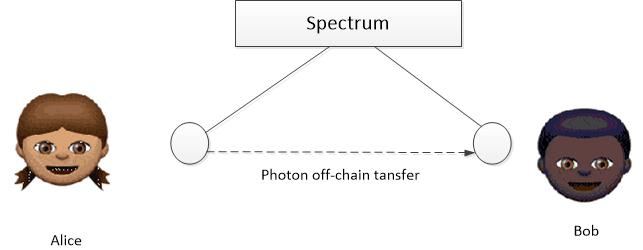
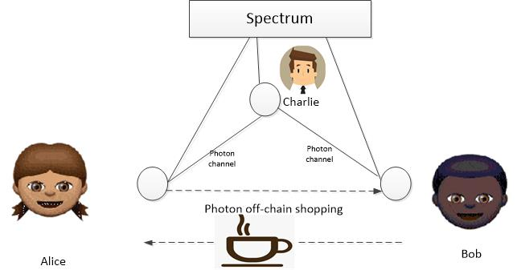
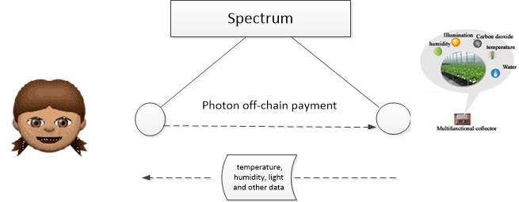
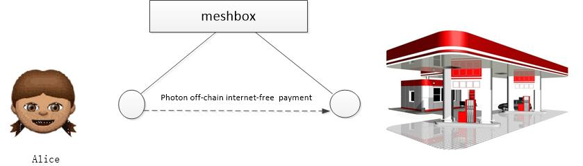
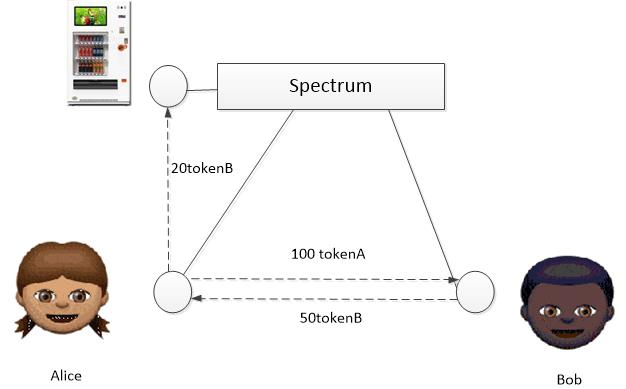
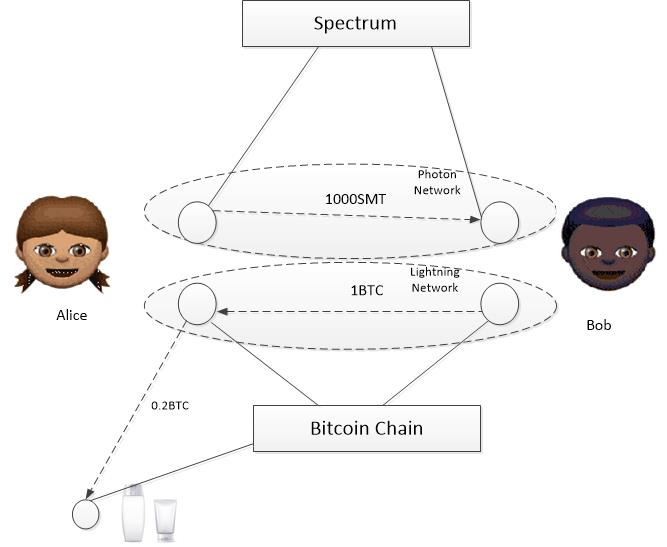

# SmartMesh Photon Network Usage scene description

As an off-chain payment network supporting the ERC20 token and ERC223 token on the spectrum blockchain, Photon Network  has the advantages of security, speed, scalability and low cost , which can meet the off-chain payment requirements of various scenarios . For better application of photon networks, this article describes the specific usage scenarios of Photon , which is convenient for users to understand and use.

## 1. Photon network installation and main functions

The latest version of photon networks (V0.91) has been released, the current mainstream operating systems supported include: Windows, Linux, macOS, Android, iOS, users can choose according to their own adapted version of the device type [Photon V0.91 released](https://github.com/SmartMeshFoundation/Photon/releases)installation, we provide installation Guide [Different platform system requirements and installation Guide](https://photonnetwork.readthedocs.io/en/latest/installation_guide/), since the photon networks rely on Spectrum block chain, therefore, users need to install Spectrum client SMC [installation](https://github.com/SmartMeshFoundation/Spectrum/wiki/Building-Specturm) (or connected to a spectrum node) and start the photon node to connect the main net or testnet of Spectrum. 
Currently, Photon has deployed contracts on both the mainnet and the testnet of Spectrum, and users can launch photon nodes as follows .

1. Create an account on the spectrum
2. Substitute the account and keystore path into the running script to set it (if you need to connect the mainnet, please update the contract address to the mainnet contract address)
3. Run the photon node startup script (see Launching Photon Nodes in [System Requirements and Installation Guide](https://photonnetwork.readthedocs.io/en/latest/installation_guide/) )
4. The photon node is used after it is started. ( [How to use photons on the spectrum chain](https://www.jianshu.com/p/53f5ef5ce3f2) )

Photon API provides key functions such as token registration, token query, channel query, channel open, channel deposit, channel withdrawal, channel transfer, channel close, channel settlement, etc. It supports functions such as direct transfer without internet support and off-chain token exchange . The new version is based on Matrix cluster communication mechanism , integrating Photon-Monitoring service and Photon-Path-Finder service. Users can delegate Photon-Monitoring to monitor the channel funds when they need to go offline, or choose to request the Photon-Path-Finder service to query route to the target node.. Photon will increase the channel charging function later, motivate the intermediate nodes online and deposit enough balance to improve the efficiency of the photon network. 

## 2. Main application scenarios of photon networks

Photon networks primarily used for  off- chain payment and off- chain exchange, which including: off-chain transfer, off-chain shopping, off-chain IOT application, off-chain internet-free payment, off-chain token atomic exchange,  cross-chain atomic exchange.

### Off- Chain Transfer  Scenario

For users with a token on the spectrum, off-chain transfers used the photon network will greatly reduce transaction costs and reduce confirmation time . Take Alice and Bob as examples, the scenario are shown as  below:

Alice is an employer and Bob is an employee. Alice hired Bob for cleaning . After the work is completed, she intends to transfer 3000 tokeA to Bob as a labor remuneration . Suppose both Alice and Bob have a spectrum account, and Alice has some tokenA on the spectrum, so Alice can transfer 3000 tokenA to Bob off the chain via the photon network .

The process is as follows:

1. Alice starts the photon network node
2. Alice queries the node to know that tokenA is not registered in the network (if it is registered, skip step 3)
3. Alice registered tokenA
4. Alice opens the channel to Bob on the tokenA network and deposit 3000 tokenA
5. Alice sends an off-chain transfer 3000 tokenA to Bob
6. Bob receives a transfer of 30 00 tokenA off  the chain

Alice and Bob's channels can continue to be used. Both parties can store money to the channel, and can also take out tokenA that does not exceed their respective balances from the channel. If either party does not want to continue using the channel, it can unilaterally close the channel or cooperate settle the channel. After the channel is settled, the balance in the channel will be returned to both accounts in the spectrum chain.

### Off-chain shopping  scenario
For merchants who accept the  payments off the chain, users can use the photon network for shopping and consumption off the chain . Take Alice and Bob (coffee shop owner) as an example, the scenario are shown as  below:

Alice is a consumer with some tokenA on the spectrum, and she plans to buy a cup of coffee using tokenA. Bob is the coffee shop owner,and  a cup of coffee is priced at 30tokenA . Charlie is a colleague of Alice and has a direct payment channel with Bob . Alice can use the photon network to buy Bob's coffee. The flow is as follows (assuming there is no direct channel between Alice and Bob) :

1. Alice query the channel condition between Alice and Bob 
2. There is no direct channel between Alice and Bob. There is a direct channel between Alice and Charlie. There is a direct channel between Charlie and Bob.
3. Alice pays Bob 30tokenA via Charlie
4. Alice gets a cup of coffee
5.  Bob received 30 tokenA

Alice consumes 30 tokenA to buy coffee. In the whole process, Alice only needs to input the other party's wallet address and the amount of consumption. The rest is automatically completed by the photon network. The entire payment process is completed within a few seconds. Bob can transfer the token to his account on-chain by withdrawing money. he can also  retain the token in the channel .

### Off-chain IoT application scenario

The combination of photon networks and the Internet of Things can incubate a wide range of application scenarios. The following two scenarios are briefly introduced.

#### Data acquisition off  the chain

The photon network node can communicate with the IoT node, and the user can obtain the latest data collected by the IoT node by sending a transfer , which the data can be  analyzed and used .

Alice owns a farm and needs to pay attention to the growing environment (humidity, temperature, light, moisture, etc.) of crops in all areas of the farm in order to be scientifically cultivated. Alice can install their own multifunctional collector equipment, but the equipment is expensive, the number is a little more, each equipment need high maintenance costs, and Alice's data usage is not very high. From an economic point of view , personal installation is not worthwhile. Things agriculture company plans to deploy more multifunctional collectors with the photon network functions in the area where Alice’s farm lie in, and environmental data acquisition in the region  will  be as an agricultural support paid services, the company can carry out large scale deployment in order to reduce the cost of a single point, with professional equipment maintenance personnel to reduce the equipment failure rate, serving multiple users to improve data utilization, and the company also have room for profit from the perspective of overall efficiency. From a market perspective, IoT company and Alice meet the supply-demand relationship, and Alice can use the micro-payments off the chain to get the data she want. Alice’s farm is assumed  to deply 20 multifunction collector point, the IOT company has registered the account address for the 20 points on the spectrum and set up off-chain payment channel among the nodes. The address of all nodes was informed to Alice and a single point data was set charge of 10token A  each  time . Then Alice gets the data flow as follows:

1. Alice wants to check  18 node position  environment data
2. Alice doesn't have to go to the site to view the data, he needs to register the account in the spectrum and transfer 1000tokenA to the account.
3. Alice uses the photon network to open the channel to 18 node  and deposit 100tokenA in the channel.
4. Alice sends 10tokenA payment to 18  node, and gets  18 node  environment data.
5. Alice wants to check the 12  node  location environment data
6. Alice no longer needs to open the channel with 12 node, pay 10tokenA to 12 node  through indirect channel transfer , and get the node information of  12 node.
7. Alice can continue to check the position of environmental data from other nodes, if the channel balance is not enough, Alice can deposit the channel between her and 18 nodes
8.   Alice gets the complete data and decides if she needs to take action.

The cooperation between Alice and the Internet of Things company is a win-win situation. Alice does not need to go to every point on the farm to view the regional environmental information. In the room, the accurate instant information can be obtained through the photon network, saving time and labor costs. The IOT company collects valuable data and obtains the user 's payment for environmental information by operating the multi-function collector. The environmental big data collected by the company can further create extended income (the data statistics can be pushed to the agricultural company to help sales and products. Upgrade and get extra compensation).

#### Off-chain sensing control

The photon network node can be combined with the sensing control of the Internet of Things node, and the user can trigger the related operation of the IoT node by sending a transfer to realize the payment control of the Internet of Things device.

The convergence of the Internet of Things and the sharing economy provides a broader life experience for a wide range of users . Alice is a white-collar company with high requirements for quality of life. She likes to listen to music, and likes a clean living environment,  also she likes to work tired for the body massage. Alice can fulfill her wishes through the payment of the photon network. Alice uses the photon network for the sensing control scenario simulation process as follows (the prerequisites for the relevant account are the same as the previous scenario) :

1. Alice rents a cleaning robot from the cleaning robot company (the robot is expensive, requires maintenance, and rent is more cost-effectively)
2. Alice sends 100tokenA off-chain  payment to the cleaning robot node through the photon network .
3. The cleaning robot receives the transfer of 100 tokenA, triggers the cleaning process, and cleans the room.
4. When the cleaning is completed , the cleaning robot company receives Alice's 100tokenA payment off the chain.
5. Alice's downstairs restaurant has a paid music robot
6. Alice sends a 50tokenA off-chain payment to the music robot through the photon network when dining.
7. The music robot receives the transfer of 50tokenA, triggers the performance program, and plays the music for Alice
8. After the performance is completed, the restaurant receives payment from Alice's off-chain 50tokenA.
9. There is a paid massage chair in the leisure center near Alice living area.
10. Alice gets off work to the leisure center to pay 80tokenA to the paid massage chair through the photon network.
11. The massage chair receives the 80tokenA off-chain payment , triggers the control switch, and starts the massage work.
12. After the massage is over, the leisure center receives Alice's 80tokenA payment off the chain.

Integration of photon networks and IOT device can also extend a wider range of scenarios, users enjoy a high quality of life adopted by more economical means of various IOT devices. IOT  company can obtain long-term benefits from large-scale use of the device. photon networks become the link between the sharing economy and the Internet of Things.

####  Internet-free payment application scenario

Internet- free payment is a transfer transaction off the chain without relying on the Internet (public chain) . In some scenarios, such as poor network signal and network congestion, if there is a demand for payment, you can use the help of the smartmesh ecological meshbox to achieve direct payment without a network link.

Alice is an office lady, lives near the airport and is far away from the company, she needs to drive to the company. Because of the poor network signal near the airport , Alice's mobile phone often cannot connect to the Internet when it is outdoors. When Alice tried to refuel through a nearby gas station , she found that the phone could not connect to the nearby network. Alice can use the meshbox of the gas station to make internet- free payments off the chain through the photon network . Alice's internet- free payment process is as follows:

1. Alice wants to oil her car for 1000tokenA gasoline  at the gas station (assuming the gas station supports tokenA payment)
2. Alice cannot connect to the Internet and the public chain, and cannot directly use the photon network for offline payment.
3. Because Alice often oil her car in this gas station, so Alice and gas station nodes are registered in the meshbox, and Alice has ever been established a direct channel with gas station node through photon network  with the random internet connection.
4. The gas station oil  Alice ‘s car for  the gasoline worth 1000tokenA .
5. Alice uses the support of meshbox to pay 1000tokenA to the gas station node via the photon network.
6. The gas station node receives 1000tokenA transfer with the meshbox support.
7. The gas station node can take out 1000tokenA from the channel when there is a random internet connection or continue to let the balance in the channel.

Internet-free payment can be extended to a number of special scenarios, such as mining areas, parking lots, sports venues, emergency payments after natural disasters, etc. Existing internet-free payment only allow direct channel payment, and subsequent photon network versions will increase indirect channel payment to increase the range of applications for internet-free  payment .

####  Off-chain token atomic  exchange application scenario

The atomic exchange of tokens off the chain can facilitate the exchange of different tokens in the spectrum. Since different application scenarios may support specific token, when a user needs to use a certain token for payment, the token balance may be insufficient and another token is large . At this point, he can exchange the token with more balance to get the  token with insufficient balance off the chain to complete the further payment needs.

Alice is a student who loves sports and often goes to a vending machine to buy a drink to quench his thirst. One day, Alice plans to buy a bottle of drink after running . At this point, she found that the balance of tokenB in her own channel was only 10 tokenB , and the beverage she liked had to pay 20token B, and only supported tokenB and tokenC payments. Alice has 100tokenA, and knows that classmate Bob has enough tokenB. At this time, Alice can use the atomic exchange through the photon network to get enough tokenB and then buy the beverage. The process is as follows (the preconditions such as account and chain channel are the same as the previous scene): 

1. Alice proposes a token atomic exchange request to Bob and sends a 100tokenA transfer to Bob (HTLC transaction).
2. Bob accepts Alice's request and sends a 50tokenB transfer to Alice (HTLC transaction)
3. Alice gets 50tokenB and Bob gets 100tokenA
4. Alice sends a 20token B transfer to the vending machine
5. The vending machine receives the payment of 20tokenB, triggers the signal, and pushes the beverage to the delivery port.
6. Alice gets the desired drink.

Token atomic exchange does not require the intervention of a third party off the chain, automatically in the case of mutual agreement, can solve many needs for different token. Therefore, the user does not need to pre-store multiple tokens in a plurality of payment channels through the photon network. If there is no type of token in the application scenario, the corresponding token can be obtained through the off-chain atomic exchange, and the corresponding operation is performed. They are all done instantly , safely and reliably off the chain.

#### Cross-chain atomic exchange application scenarios

Cross-chain atomic exange can meet a wider range of token exchange needs. At present, the exchange of tokens in different public chains is mainly realized through exchanges. The photon network provides the Atmosphere interface, which can realize the off-chain atomic exchange between two public chains through the smartmesh ecology Atmosphere (currently supports the token  exchange between following blockchains,which are Bitcoin, Ethereum, Litecoin, and Spectrum).

Alice is an actor who often uses moisturizers from a foreign cosmetics company. The company's products support cash and bitcoin payments , approximately $1,200 or 0.2 BTC . Alice wants to pay BTC to buy a moisturizer through Lightning Network, but Alice doesn't have BTC in the Bitcoin account. Alice can use the photon network to cross-chain atomic exchange to exchange SMT to BTC and then buy moisturizer. The corresponding process is as follows (Alice and Bob has accounts on Bitcoin and Spectrum, and has payment channels on both Photon Networks and Lightning Networks):

1. Alice posts information on Atmosphore, hoping to replace 1 BTC with 1000 SMT
2. After Bob saw it, he communicated with Alice and exchanged opinions.
3. Bob and Alice are starting their own atmosphere service (start the corresponding photon networks and lightning network)
4. Alice initiates a transaction through the photon network , specifying Secret with an amount of 1000 and a token type of SMT (HTLC transaction)
5. Bob waits  on the photon network for receiving 1000 SMT transaction from Alice
6. Bob verifies the 1000SMT received from Alice, uses the same  secret to sent 1 BTC (HTLC transaction) through the lightning network
7. Alice receives 1BTC, Bob receives 1000SMT , atomic exchange is completed
8. Alice pays 0.2BTC to the cosmetics company, and the cosmetics company delivers the moisturizer to Alice.

Cross-chain chain atomic exchange connect tokens (values) of multiple public chains to avoid transactional congestion on the chain, save transaction costs, save waiting time, and still have security and decentralization guarantees. With the growing the public chain scenarios, cross-chain fusion application of exchange and payment will become more frequent, will further extend the smartmesh ecological system usage scenarios for photon networks, and be suitable for multi-chain atomic token exchange (wormhole), let us look forward to the arrival of the upgraded version of the photon network,named as wormhole.

## 3. Precautions in the usage of photon networks

In order to use photon networks correctly and safely, users need to pay attention to the following situations:

1. The spectrum nodes connected to the photon network nodes need to operate stably . Security of the photon network funds depends on the spectrum, in order to ensure that the data which the photon network node owned is correct, the user can initiate a spectrum node locally, also can connected to a server with stable spectrum node (the server is always synchronized and reliable operation) . If there is a problem with the connected spectrum nodes, the photon node needs to replace the connected spectrum nodes in time.
2. Photon network nodes need to have a dedicated account. The user needs to create a unique account for the photon network node on the spectrum , and when the photon network node is running, the user does not perform other manual on-chain transactions through the account, otherwise it may lead to some unexpected situations.
3. The photon network node account needs to have enough SMT. The photon network will not remind the user whether there is enough SMT in the node account, so the user needs to transfer enough SMT to the photon network node account to pay for the transaction cost of the on-chain operation such as opening the channel.
4. Photon network node local database DB protection. The local state database of the photon network node is located at ~ /.photon. Users should not delete this database or modify the data in the database. It is also recommended to back up the database regularly to ensure the security of the node funds.
5. The photon network node can be selected offline or online depending on the purpose. In a photon network, some nodes, such as mobile nodes (for payment requirements only), may choose to delegate evidence to the photon monitoring and go offline; others, such as photon nodes in a meshbox, are used to provide mediated transfer services. Confirm that it is always running . If the photon network node is offline due to an unexpected reason , the user needs to restart the node.

