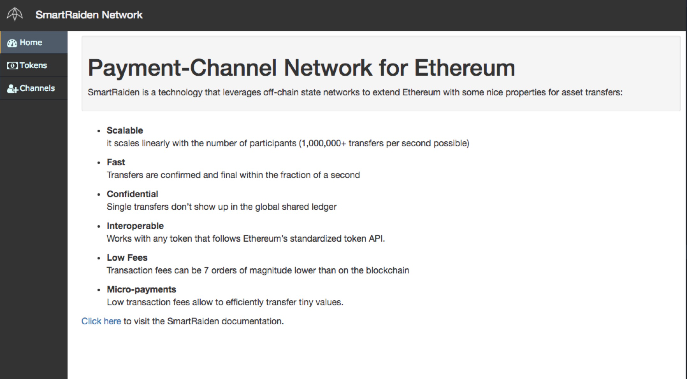
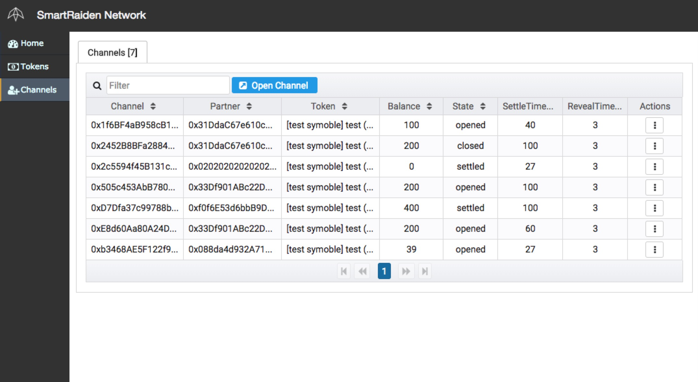

# Web Application Tutorial

In order to quickly give an overview and idea of what the SmartRaiden Developer Preview is capable of, a simple web application has been created. This application utilizes the [SmartRaiden REST API endpoints](./rest_api.md) to allow the user to interact with token networks, transfer tokens, see the current status of open channels along with closing and settling channels to name some of the functionalities. For a more specific guide of the API itself see the [Getting started with the SmartRaiden API](./api_walkthrough.md).


## Running the web application

There are a few simple steps that needs to be carried out in order to run the SmartRaiden web application. Firstly, SmartRaiden needs to be installed. See [install instructions](./installation_guide.md) for this.

The only dependency needed to run the web application is [node.js](https://nodejs.org/en/download/).

Once SmartRaiden and node.js has been installed, it is quite easy to install and start the web application. 

```sh
cd ui/web 
npm install 
```
This will install all the dependencies needed by Angular to run the project.

Run `ng serve` for a dev server.
```
ng serve --proxy-config proxy.config.json --base-href /ui/ --deploy-url /ui/ --delete-output-path false
```

Now all that is left to do is to navigate to [localhost:4200](localhost:4200) and interaction with SmartRaiden through a web application can begin.

## The landing page

The first thing that will meet the user is the landing page. The landing page is meant to give a short introduction to SmartRaiden and link to some relevant documentation.

Below is a screenshot of the landing page.



One last thing that might be interesting to note is that the address of the running Raiden node is always displayed in the top bar.

## Tokens

The `Tokens` view provides information about the registered token networks. Furthermore it also allows for automatically joining an existing token network along with registering a new token network.

The first thing to notice in this view is the list of tokens for which a token network exists. All tokens that have been registered in Raiden will show up in this list. If the user knows the name or the address of a token, it’s very easy to search for it using the `Filter` bar. If the token the user searches for does not show up, it most likely means that it is not yet registered. Registering can however be done by pressing the `Register New Token` button and provide the token address. For each token in the list of tokens some information is provided. This information includes the `Symbol` of the token, the `Address` of the token, the `Name` of the token and the user’s `Balance` of a specific token. It’s easy to sort the tokens, so that only tokens that a user actually holds, show up in the beginning of the list. This is done simply by pressing the name of the value desired for sorting.

In the `Actions` column it is possible to open an actions menu for each token network. This menu provides the option to `Join Network`. A pop up will then appear where the user can choose how many tokens to automatically join the token network with. See [connect](./rest_api.md) for more details on how this works.

In this view it is also possible to `Swap Tokens`. This is done by pressing the `Swap Tokens` button and then filling in the form. For more information on what a token swap is, please see [token swaps](./api_walkthrough.md).


Above is a screenshot of the Tokens view with some registered tokens.

## Channels

The `Channels` page is where a lot of the interesting stuff is going on. If a node has no open channels, not a lot of interesting information is displayed here. With no open channels the most interesting thing that can be done from this view is to manually open a new channel.This is done by pressing the `Open Channel` button and filling in the information in the pop up formula.

Once a channel is opened it will show up in the list of open channels. For each channel some relevant data is shown. The `Channel`, `Partner` and `Token` fields represent the address of the payment channel itself, the address of the partner and the address of the token that the channel is opened with. Furthermore the `Balance` shows the amount of tokens that the Raiden node has available for the specific channel. The `State` represents the current state of the channel i.e. if it is opened, closed or settled. `SettleTimeout` and `RevealTimeout` shows the corresponding values that the channel was opened with. Lastly there is a menu button that represents the interactions that can be made with a channel. `Transfer` sends a transfer to the counterparty of the channel. `Deposit` allows the user to deposit more funds in the channel. `Close` closes the channel and updated the `State` of the channel to closed. Once the channel is closed no more transfers can be carried out and the `settle_timeout` is initialised. Furthermore once the `settle_timeout` has expired `Settle` can be called. This will settle the channel and payout the correct amount of the deposit to each channel participant. It is possible to sort the list of channels by any of the columns or to search for a specific partner or token address etc. using the `Filter` field.



Above is a screenshot of the Channels view with some open channels.

